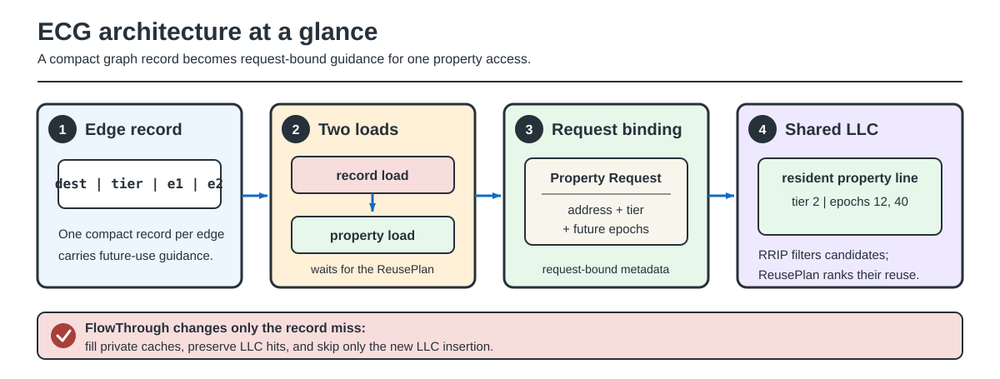

# ECG Next

**ReusePlan and FlowThrough cache architecture for irregular graph analytics**

ECG Next carries compact reuse metadata with streamed graph records, binds that
metadata to the corresponding property request, and uses it to guide
last-level-cache replacement and placement.

## Architecture

- **ReusePlan records** encode a reuse tier and the next two property-reuse epochs.
- **ReuseBind** binds ReusePlan metadata to the exact property request that consumes it.
- **FlowThrough** prevents one-touch edge records from occupying the shared
  LLC after a miss while preserving private-cache fills and LLC hits.

### Access lifecycle

1. A graph pass emits a compact ReusePlan for each governed edge. The record
   carries the destination, reuse tier, and two quantized future-use epochs.
2. The kernel loads that record with ordinary placement or FlowThrough.
   FlowThrough changes only what happens after a record misses in the LLC.
3. The property load waits for the ReusePlan as a register dependency.
   Computed-address and indexed forms share the same request-bound semantics.
4. The load-store queue creates an ordinary property Request and attaches the
   ReuseBind fields before the request enters the cache hierarchy.
5. An LLC hit or fill stores the tier and future epochs beside the resident
   property line. MSHR merge rules reject conflicting metadata.
6. Later replacement first applies the shared RRIP eligibility rule, then uses
   the nearest future reuse to rank eligible property lines. Load return,
   writeback, and retirement remain ordinary.

### Mechanism boundaries

| Mechanism | Changes | Preserves |
|---|---|---|
| **ReusePlan** | Metadata used to rank eligible LLC victims | Graph result and property address |
| **ReuseBind** | Metadata carried by one exact property Request | Load ordering, replay, response, and retirement |
| **FlowThrough** | LLC insertion after a record miss | Private-cache fills, LLC hits, and all property requests |

The shared implementation covers PageRank, BFS, SSSP, Betweenness Centrality,
and Connected Components.

The [property-to-cache walkthrough](wiki/Property-to-Cache-Walkthrough.md)
provides the numeric example and structure-level processor view.

## RISC-V instruction support

ECG Next includes an experimental RISC-V custom-0 implementation in gem5 and
build support for matching RISC-V graph-kernel binaries:

| Instruction family | Role |
|---|---|
| `ecg.plan.load*` | Load a ReusePlan record with ordinary placement |
| `ecg.flow.load*` | Load a ReusePlan record with FlowThrough placement |
| `ecg.bind.load.*` | Bind metadata to a computed-address property load |
| `ecg.bind.iload.*` | Fuse indexed address generation with ReuseBind |

The implementation is a research ISA extension, not a ratified RISC-V
extension or a fabricated processor. See the
[stage-by-stage instruction path](wiki/RISC-V-Instruction-Path.md).

## Evaluation backends

| Backend | Role |
|---|---|
| **gem5 O3** | Architectural timing and request-bound ReuseBind behavior |
| **cache_sim** | Functional replacement behavior and total memory traffic |
| **Sniper** | Equal-work, larger-scale cache and traffic trends |
| **RTL models** | Synthesizable ReusePlan metadata and physical-cost components |

Architectural timing is reported from gem5 O3 only. Each backend is compared
with its own matching baseline; absolute miss rates are not compared across
simulators.

## Documentation

- [Illustrated design guide](wiki/ReusePlan-FlowThrough.md) explains ReusePlan,
  ReuseBind, FlowThrough, and the request path.
- [RISC-V instruction path](wiki/RISC-V-Instruction-Path.md) follows each
  custom load through decode, rename, issue, the LSQ, caches, and completion.
- [Property-to-cache walkthrough](wiki/Property-to-Cache-Walkthrough.md)
  follows one numeric example through every stage and mode.
- [Related work](wiki/Related-Work.md) identifies direct baselines and the
  cache-policy and graph-locality foundations.
- [Evaluation methodology](wiki/Evaluation-Methodology.md) defines workloads,
  baselines, metrics, and simulator roles.
- [Build and reproduction](wiki/Reproduction.md) covers datasets, simulator
  setup, tests, and experiment commands.
- [Repository hygiene](wiki/Repository-Hygiene.md) lists tracked and local-only
  artifacts.

## Repository layout

| Path | Purpose |
|---|---|
| `bench/include/` | Shared policies, metadata, and simulator integration |
| `bench/src_sim/` | Functional cache-simulator graph kernels |
| `bench/src_gem5/` | gem5 graph kernels |
| `bench/src_sniper/` | Sniper graph workload |
| `bench/src_rtl/` | Synthesizable ReusePlan cost models and testbenches |
| `scripts/experiments/ecg/` | Experiment runners, gates, and analysis tools |
| `scripts/test/` | Unit, integration, and public-surface checks |
| `wiki/` | Design, methodology, reproduction guide, and figures |

Generated artifacts are kept under `results/` and are not tracked. Performance
tables will be published only after the final evaluation is complete.
