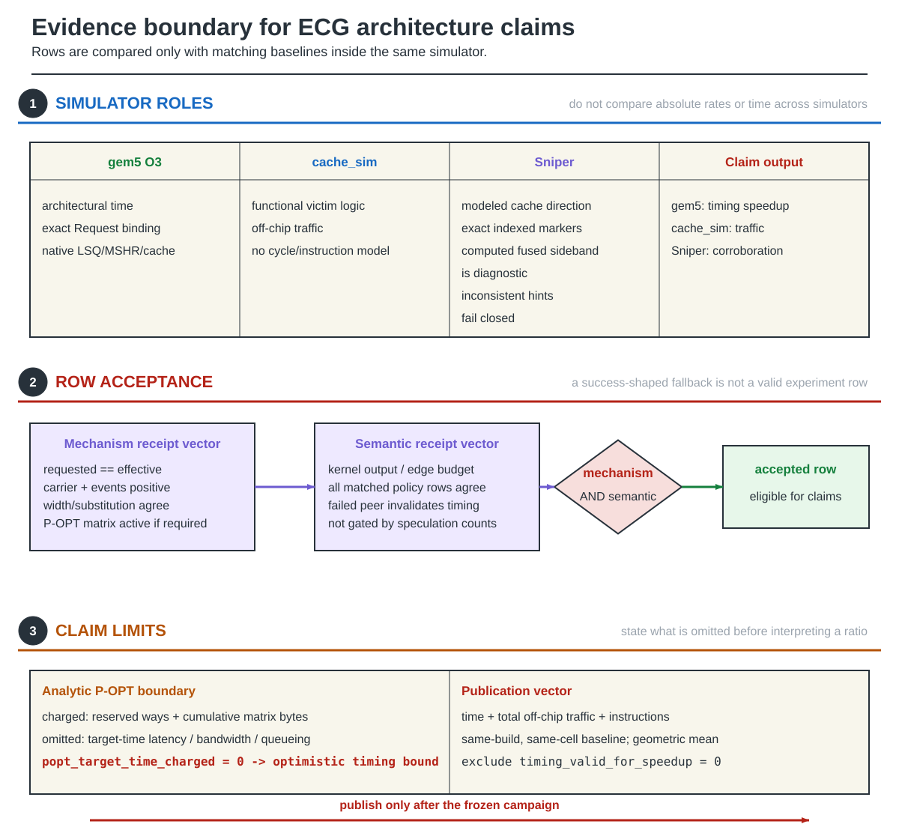

# Evaluation Methodology

This page defines what each ECG experiment can establish. It contains no
performance results.

### Figure 1 — Evaluation evidence and admissible claims



**Figure 1.** A result row is accepted only after mechanism activity and
semantic output are both verified.

## 1. Simulator roles

| Simulator | Valid use | Explicit limit |
|---|---|---|
| **gem5 O3** | architectural execution time, decoded ISA path, dynamic Request binding, native LSQ/MSHR/cache behavior | sampled graphs and bounded detailed simulation |
| **cache_sim** | shared victim logic, functional cache behavior, prefetch/traffic accounting, large graph sweeps | no cycle or instruction model; native runtime Requests are abstracted |
| **Sniper** | matched-work modeled cache and traffic evidence at larger scale | time is not ReuseBind speedup evidence; delivery and pipeline behavior are modeled |

Only gem5 O3 execution time is used for architectural speedup. cache_sim does
not model cycles or instructions. Sniper time is not used as a ReuseBind
speedup metric. Every simulator is compared with its own same-build, same-cell
baseline; absolute miss rates and timing are not compared across simulators.

The default indexed Sniper ReusePlan path uses per-edge delivery markers.
The computed fused sideband remains diagnostic and rejects source/line cases
whose per-edge hints cannot be represented consistently.

## 2. Fail-closed row acceptance

An experiment row must establish:

1. requested and effective policy/mode agree;
2. the active structural carrier is the one the workload actually consumes;
3. record width, substitution, and traffic fields agree;
4. FlowThrough activity is positive when requested;
5. P-OPT context, matrix, and phase-two queries are active when required; and
6. semantic output agrees across every policy row in the matched group.

If any matched row fails, group timing is invalid. Memory-order violations,
dependency conflicts, and squashes are O3 diagnostics; semantic receipts decide
architectural correctness.

## 3. Structural FlowThrough fairness

The `--flowthrough all` control gives LRU, GRASP, P-OPT, and ReusePlan the same
no-allocate opportunity on their actual structural carrier. It is distinct
from request-specific `ECG_FLOWTHROUGH`.

Receipts are backend-specific:

- cache_sim: positive structural accesses;
- gem5: positive structural no-allocate miss targets; and
- Sniper: positive structural read and fill-write counts.

This control removes a policy-specific structural allocation advantage; it does
not equalize record width, matrix traffic, instruction count, or victim
quality.

## 4. Primary quantities

The primary quantities are always reported together:

1. gem5 O3 execution time;
2. total off-chip traffic, including demand, prefetch, metadata, writeback,
   and modeled reference-structure traffic;
3. retired instructions for complete-design comparisons; and
4. policy/mechanism activity receipts.

Per-cell ratios use a matching baseline from the same invocation and build and
are aggregated with a geometric mean. A +/-2% interval classifies a per-cell
ratio as approximately equal. Rows with `timing_valid_for_speedup=0` are
excluded from timing ratios.

### Prefetching and idealized models

With a prefetcher enabled, demand misses alone are not performance evidence:
prefetching may move traffic from demand to prefetch requests. Execution time
and total off-chip traffic remain primary, and MSHR pressure, bandwidth,
queueing, and overfetch must remain visible.

A mechanism with perfect prediction or unlimited latency, bandwidth, queue, or
MSHR resources is reported as an upper bound rather than as measured hardware
performance.

### Instruction-count interpretation

Complete-design comparisons include record layout, transport, ISA, placement,
and replacement, so time, traffic, and retired instructions are interpreted
together. Replacement-only attribution compares transport-matched ReusePlan
policies and requires exact per-cell instruction equality.

IPC is derived from instructions and time; it is not independent evidence.
Counterfactual instruction normalization is a sensitivity, not a measurement.

## 5. P-OPT accounting

Analytic P-OPT charges reserved LLC capacity and cumulative matrix traffic. It
sets `popt_target_time_charged=0`, so matrix-stream latency is omitted, as are
target-time lookup latency, target-time bandwidth, queueing, and contention.
Its timing is therefore an optimistic P-OPT bound, specifically a lower bound
on time, not a realistic target-time implementation.

The reference matrix assumes an ordered sweep. Final reference rows are
limited to PageRank and Connected Components. BFS and SSSP comparisons are
project extensions: frontier order does not satisfy P-OPT's monotonic
sweep-order epoch assumption, so those rows remain diagnostic.

The two resident columns are current and next. Initial loading belongs to
cumulative stream traffic, not a third resident column.

`size_correct` scales the reservation with both the graph and LLC rather than
assuming that "two columns" means two cache ways:

```
column_bytes = ceil(vertices * property_bytes / line_size)
reserved_ways = ceil(2 * column_bytes / bytes_per_way)
```

This matches the pinned P-OPT artifact's `registerOffsetMatrix()` rule: for
PageRank, `m_startWay` is the ceiling of two irregular-data columns divided by
one way's capacity, and ordinary data replacement considers only ways
`m_startWay..15`. The charged row is therefore a scalability projection for
the evaluated graph and LLC, not a claim that every P-OPT experiment reserves
a fixed two ways.

For Twitter-2010 at the primary 8 MiB, 16-way LLC, one column is 2,603,265
bytes and the two resident columns require 10 ways, leaving six data ways.
Full-capacity uncharged P-OPT records 371,203,581 LLC misses, 18.0% fewer than
LRU's 452,625,102, so the replacement policy itself remains beneficial.
Size-correct charged P-OPT records 483,462,525 demand misses; the loss of ten
data ways accounts for the large gap, while the complete 256-column stream
adds another 10,413,060 miss-equivalent transfers. Charged P-OPT being worse
than LRU at this Twitter/8 MiB design point is thus a scaling result, not a
contradiction of P-OPT's results on different graph/cache ratios.

### 5.1 GRASP paper baseline

`GRASP_PAPER` preserves the upstream trace simulator's PageRank mapping:
each registered property region receives a high-reuse boundary equal to 50%
of LLC capacity, with the moderate boundary at twice that allocation. It is
separate from the older `GRASP` array-relative 15% sensitivity retained for
historical result compatibility.

At upstream GRASP commit `6e3814430265fc4f2513c95ef131a6522bc9d389`,
the official 1 MiB, 16-way web-Google PageRank trace contains 9,887,515
accesses. After the artifact's missing-return undefined behavior is repaired
with one `return 0`, the official simulator reports 8,687,691 LRU misses and
6,397,965 GRASP misses. `grasp_trace_replay` reproduces both counts exactly;
its optional empty-way behavior is confined to artifact replay because the
official trace simulator may replace a cold line while invalid ways remain.
Normal cache_sim, gem5, and Sniper retain real-cache invalid-way-first fills.

### 5.2 Single-epoch P-OPT reconstruction

The [P-OPT paper](http://brandonlucia.com/pubs/POPT_HPCA21_CameraReady.pdf),
Section VII-B, describes P-OPT-SE with one current-epoch column, bit 7
distinguishing current-epoch presence, bit 6 indicating next-epoch presence,
and six payload bits. The pinned public artifact does not implement SE. The
paper also leaves unspecified the returned rank after the current epoch's
last use when the next-epoch flag is clear. These rows are therefore
paper-constrained reconstructions, not bit-exact reproductions of Figure 11.

`POPT_SE` groups that unspecified later-use case at rank 2.
`POPT_SE_DISTANT` instead assigns rank 63. Both use 64 subepoch bins,
return rank 0 before or within the last-use subepoch and rank 1 for an
upcoming next-epoch use, and decode absent-current-epoch distances from six
bits. After the final epoch's last use they return 63. Neither decoder reads
the next column. Both interpretations must be reported; their miss counts
are not formal upper and lower bounds.

SE is initially supported only by serial cache_sim PageRank with 4-byte
properties, 64-byte lines, and 256 epochs. Other backends and geometries fail
closed. The runner pins one active column and size-correct capacity charging
per SE row without changing ordinary P-OPT rows in the same matrix.
`:UNCHARGED` is available as a separate replacement-quality diagnostic.
An accepted SE row requires its encoding and post-final-rule receipt and the
same PageRank semantic result as every other policy in its group.

One-column residency does not halve the backing matrix or its cumulative
stream. Twitter still has 666,435,840 logical backing bytes and 256 streamed
columns per complete traversal. SE's 2,603,265-byte active column reserves
5, 3, and 2 ways at 8, 16, and 24 MiB respectively, versus full P-OPT's
10, 5, and 4 ways. This differs from the old two-way diagnostic, which
retained full two-column encoding and lookup without paying its capacity.

Cost domains remain separate: `popt_backing_matrix_bytes` is the complete
matrix in memory, `popt_matrix_bytes` is active-column payload, and
`popt_reserved_bytes` is the whole-way LLC reservation. REF32's added
per-line/controller state is on-chip storage. Ratios against the complete
P-OPT matrix are total metadata-footprint ratios, not silicon-area savings.
Area comparisons must also charge REF32's added state and controller logic.
`total_offchip_traffic_with_overhead` includes reads, writebacks, and any
analytic matrix stream; demand LLC misses are reported separately.

## 6. Workloads and campaign roles

The literature-scale PageRank screen uses fixed 262,144-vertex samples of
web-Google, Pokec, Patents, roadNet-CA, LiveJournal, and Orkut at iteration
counts 1 and 8. Its hashes, geometries, policy roles, and decision thresholds
are in `pagerank_literature_scale.json`.

The earlier three-graph sensitivity study uses web-Google, soc-pokec, and
cit-Patents. Iteration counts are 1, 2, 4, and 8. Its configuration is
[`pagerank_study.json`](https://github.com/UVA-LavaLab/ECG_GrAPL/blob/main/scripts/experiments/ecg/configs/pagerank_study.json).

The publication corpus must include web-Google, Pokec, Patents, roadNet-CA,
LiveJournal, and Orkut; Twitter-2010 is the cache-only stress case.

- gem5 O3 supplies compact PageRank architectural timing.
- cache_sim supplies full-graph all-kernel replacement and traffic.
- Sniper supplies bounded matched-work cache/traffic corroboration.

Selector generations 1 and 2 did not satisfy the retained representativeness
and regret checks. They are retained as negative diagnostics and must not be
presented as detailed-simulator performance policies.

## 7. Two separate campaigns

The replacement campaign and the transport campaign are preregistered
separately, run separately, and gated separately. Evidence and receipts are
never shared between them.

### 7.1 Replacement campaign

The literature-scale replacement campaign compares ReusePlan victim selection
against SRRIP, GRASP, and P-OPT under `pagerank_literature_scale.json`. Its
screen decision stands at STOP, so it supports no ReusePlan replacement claim
against those baselines. That decision remains the authoritative record for
replacement, and its configuration, thresholds, and stages are frozen. Rows and
receipts produced under earlier commits are not admissible evidence for either
campaign.

### 7.2 Transport campaign

The transport campaign isolates compact ReusePlan record transport and
structural FlowThrough while replacement stays pure LRU. Its configuration is
`transport_literature_scale.json`; its manifest profile is
`reuse_plan_transport_campaign`.

- The comparison is `LRU` against `ECG_REUSE_PLAN_LRU_FLOWTHROUGH`. Both arms
  select victims with LRU and both run `--flowthrough all`, so structural
  FlowThrough is symmetric and only graph representation, request path, and
  record transport differ.
- Timing uses the same six 262,144-vertex PageRank samples, geometries, and
  iteration-1/iteration-8 semantic receipts as the replacement screen, with
  gem5 O3, the computed-address compact trace-free path, 16 epochs, 2 tier
  bits, 4-byte records, and no prefetcher.
- Full-graph 8-byte and 4-byte cache_sim roles are matched cell for cell over
  `pr`, `bfs`, `bc`, and `cc` on the five compact-eligible graphs.
  `soc-LiveJournal1` is excluded from this width comparison because its full
  graph needs 23 destination bits, and `23 + 2 + 4 + 4 = 33` does not fit a
  32-bit record.
- Bounded matched-work Sniper rows with 8-byte records corroborate demand LLC
  load misses only. Sniper does not expose byte-level off-chip traffic for
  this role, and its LLC load-miss count excludes writeback bytes.

Admissible claims are limited to transport and placement: PageRank execution
time and off-chip traffic against an identical LRU cell, full-graph record
substitution at 4 bytes against the matched 8-byte control on the five
compact-eligible graphs, and Sniper demand-LLC-miss non-regression. No
replacement-policy claim, no comparison against SRRIP, GRASP, or P-OPT, no
Sniper byte-traffic claim, no hardware-cost claim, and no timing claim from
Sniper or from the mechanism stage may be drawn from it.

This is a confirmatory campaign, not a first observation. Earlier symmetric
iteration-1 rows at commit `14b82753` already contained the same LRU transport
control; they informed the transport-only scope but are excluded from the new
campaign evidence. The configuration records those prior ratios explicitly.
The new thresholds use the existing frozen +/-2% tie band rather than being
selected from the confirmatory rows: an aggregate ratio of at most 0.98 is
required for a positive timing or compact-width claim, while 1.02 is the
maximum material-regression bound.

The screen therefore requires an aggregate geometric-mean time ratio of at
most 0.98 and an aggregate traffic ratio of at most 1.02, with every per-cell
time and traffic ratio at most 1.02. The complete phase repeats those limits at
iteration 8, requires an aggregate compact/wide off-chip traffic ratio of at
most 0.98 with per-cell traffic and LLC-miss ratios at most 1.02, and requires
Sniper aggregate and per-cell demand-LLC-miss ratios at most 1.02.

Configuration version 2 records one validation amendment discovered before
any full cache role was accepted. When `--flowthrough all` is active, the
common structural no-allocate path intentionally supersedes the candidate's
duplicate static record no-allocate path. cache_sim now records that
subsumption explicitly and accepts it only when structural FlowThrough is
active with positive accesses. The first screen receipt and attempted full
cache run are invalidated by the configuration amendment; no threshold,
policy, stage, or claim changed.

Configuration version 3 records a second validation amendment discovered in
the first Sniper role. Distinct per-edge records may target different vertices
within one property cache line and legitimately carry different future hints.
The Sniper fused sideband now preserves all destination records and binds the
certified prefix by current source plus the original bound property address,
rather than collapsing records by source and cache line. The marker-free
post-prefix lookup remains line-granular, but the Sniper role uses pure LRU
replacement and supplies no admissible timing, so those hints cannot affect
the campaign's victim choice. All version-2 screen and full-role evidence is
invalidated; thresholds, policies, stage roster, and admissible claims remain
unchanged.

### 7.3 REF32 original-goal recovery

`ECG_REF32_RP_COMMIT` is a separate candidate that returns to the original ECG
goal: improve cache behavior relative to GRASP and P-OPT without retaining
P-OPT's runtime rereference matrix.

For certified n18 DBG-ordered PageRank graphs, each 32-bit edge record contains
an 18-bit destination, an 8-bit forward property-line reference, a 2-bit
finite/dead/wrap/unknown state, and a 4-bit forward-record prefetch action. The
reference uses a five-bit exponent and three-bit mantissa. A 21-bit per-LLC-line
deadline covers the complete recorded iteration while preserving safe modular
expiry; a passed prediction becomes unknown, never dead.

For n19 through n26 graphs, including Twitter-2010, the record switches to the
scale6 layout: a 26-bit destination plus one six-bit future token. Token zero is
unknown, token one is dead, and the remaining values encode finite-current or
wrap distances in 31 logarithmic classes. The prefetch target is derived from
the same 16-record lookahead buffer, so it consumes no additional edge bits.
The LLC stores a 32-bit iteration position plus state and prefetch origin.

Private-cache hits update LLC metadata through a bounded commit-only channel:
16 entries, eight governed requests of latency, one update per governed request,
and cache-line coalescing. The selective prefetch path has eight pending entries,
the same eight-request latency, one issue per eight governed requests, and an
LLC-only fill. It reads the selected destination from a 16-record lookahead
buffer, rejects resident or pending duplicates, and checks replacement
admission before issuing.

The record substitutes for the ordinary 4-byte CSR destination and has no
sidecar. At a 512 KiB, 64-byte-line LLC, the accounted added state is 24 bits per
line plus the two bounded queues, 16-record lookahead buffer, and control state:
199,232 bits total. The corresponding n18, 256-epoch P-OPT matrix is 33,554,432
bits, a 168.4x reduction before counting P-OPT's reserved LLC capacity.

At Twitter-2010 scale (41,652,230 vertices, 1,468,364,884 edges) and an 8 MiB
LLC, scale6 accounts for about 560 KiB of LLC/control state. P-OPT's
256-epoch matrix is about 635.6 MiB, a 1,161x reduction. The packed Twitter
record stream remains the original four bytes per edge; no sidecar is added.

Before full Twitter conversion, the scale6 format is forced onto all six n18
graphs with a virtual 26-bit ID width. Promotion requires every graph to beat
full-capacity P-OPT in LLC misses, aggregate traffic no worse than P-OPT, and
validated 32-bit record, 32-bit deadline, bounded-channel, prefetch, and
resource receipts. Full Twitter evidence remains a separate required gate.

The certified Twitter gate completed on graph SHA-256
`7942eb7fb4376e66f2e0e0a569e6d1093659d9949e24d899d02509674d828be3`.
All seven policies executed one complete sweep of 1,468,364,884 directed
edges and produced score checksum `df4fdaf1e3957ce9`.

At an 8 MiB, 16-way LLC, scale6 replacement-only records 326,257,584
LLC misses. The combined replacement-plus-prefetch policy records 292,056,469:
35.5% fewer than LRU, 32.1% fewer than SRRIP, 23.2% fewer than
`GRASP_PAPER`, and 21.3% fewer than full-capacity uncharged P-OPT. Its
off-chip traffic is 12.1% below uncharged P-OPT.

The combined row issues 34,273,001 prefetches, of which 34,200,921 are useful.
The commit and prefetch queues report zero capacity drops, with maximum
occupancies of eight and one entries respectively. Accounted REF32 state is
4,590,584 bits versus 5,331,486,720 bits for the 256-epoch P-OPT matrix, a
1,161.4x reduction. The authoritative matrix is
`results/ecg_experiments/runs/twitter_ref32_7669a3aa/roi_matrix.json`
(SHA-256 `610cc706b51d65aabb1a22dee652669e8a75ca1783e24abf223990ca89a1c48f`).

To expose a configuration where the size-correct P-OPT charge remains
beneficial, the same seven-policy Twitter matrix was also run at a 16 MiB,
16-way LLC. The two resident P-OPT columns then reserve five ways and leave
eleven data ways:

| Policy | LLC misses | Reduction versus LRU |
|---|---:|---:|
| LRU | 388,828,693 | -- |
| SRRIP | 365,844,751 | 5.9% |
| `GRASP_PAPER` | 314,999,063 | 19.0% |
| Full-capacity uncharged P-OPT | 296,111,526 | 23.9% |
| Size-correct charged P-OPT | 340,362,063 | 12.5% |
| Scale6 replacement-only | 265,597,230 | 31.7% |
| Scale6 replacement + prefetch | 238,918,842 | 38.5% |

Thus charged P-OPT beats both LRU and SRRIP at this capacity. Adding its
10,413,060 analytic matrix-stream reads to 341,476,852 raw off-chip transfers
gives 351,889,912 transfers, 9.8% below LRU. Scale6 combined records
266,758,802 off-chip transfers, 24.2% below that matrix-inclusive charged
P-OPT value and 10.3% below uncharged P-OPT.

Scale6 replacement-only remains 10.3% below full-capacity uncharged P-OPT in
LLC misses, while combined Scale6 is 19.3% below uncharged P-OPT and 29.8%
below charged P-OPT. Both bounded queues report zero drops. Accounted Scale6
state is 9,178,104 bits, a 580.9x reduction from P-OPT's complete matrix. The
seven rows again report one iteration, 1,468,364,884 semantic edges, and
checksum `df4fdaf1e3957ce9`. The complete 16 MiB matrix is
`results/ecg_experiments/runs/twitter_ref32_16mb_2dbb6680/roi_matrix.json`
(SHA-256 `608370f0d2a9dd72d8319bcadfee2837c1a58bc34da734dc520d90d418f0a0e5`).

The P-OPT paper's baseline LLC is 3 MiB per core across eight cores: 24 MiB,
16-way. Its non-power-of-two set mapping uses modulo indexing. Section VII-B
and Figure 11 explicitly scale the reserved-way count with graph size: full
two-column P-OPT uses two ways near 18--21 million vertices, three ways at
32 million, and four ways near 40--43 million. Twitter's 41,652,230 vertices
therefore require four ways at 24 MiB, not two.

The 24 MiB LLC comparison retains the project's 128 KiB L2, rather than the
paper's 256 KiB L2; it is not a complete reproduction of the paper's system.
The Twitter matrix gives:

| Policy | LLC misses | Reduction versus LRU |
|---|---:|---:|
| LRU | 348,781,423 | -- |
| SRRIP | 324,925,497 | 6.8% |
| `GRASP_PAPER` | 276,638,624 | 20.7% |
| Full-capacity uncharged P-OPT | 252,862,518 | 27.5% |
| Size-correct four-way P-OPT | 286,310,073 | 17.9% |
| Scale6 replacement-only | 230,428,305 | 33.9% |
| Scale6 replacement + prefetch | 208,422,358 | 40.2% |

At this graph size, charged two-column P-OPT has 3.5% more demand LLC misses
than `GRASP_PAPER`. Including 10,413,060 matrix-stream transfers raises its
miss-equivalent total to 296,723,133, 7.3% above GRASP. This does not
contradict the paper: Twitter was not one of its inputs, and Section VII-B
identifies the growing metadata reservation as the large-graph limitation.

An explicitly infeasible two-way sensitivity retains the 24 MiB cache's 24,576
sets but exposes 14 data ways. It records 268,219,327 demand misses, 3.0% fewer
than GRASP. The two ways hold only 3,145,728 bytes, however, while Twitter's
two active columns require 5,206,530 bytes. After adding the same matrix
stream, the sensitivity reaches 278,632,387 miss-equivalent transfers, 0.7%
above GRASP. It is not a valid full P-OPT result. The paper's valid
lower-footprint alternative is P-OPT-SE, which stores one column and changes
the metadata encoding and replacement information; it must be evaluated as a
separate policy rather than represented by undercharging full P-OPT.

Scale6 combined has 24.7% fewer LLC misses than GRASP, 27.2% fewer than
size-correct charged P-OPT, and 17.6% fewer than full-capacity uncharged P-OPT.
Replacement-only Scale6 also beats GRASP by 16.7% and uncharged P-OPT by 8.9%.
The authoritative 24 MiB matrix is
`results/ecg_experiments/runs/twitter_ref32_24mb_6a1b9f29/roi_matrix.json`
(SHA-256 `a145ba982e8fcfaa198899382f7c026606a58647aa0d5b642b20d2d75a708d0d`).
The two-way diagnostic is
`results/ecg_experiments/runs/twitter_popt_24mb_fixed2_sensitivity/roi_matrix.json`
(SHA-256 `7dfbc7c7ff2c9104a6bc095694842a88023a86c78e804f13896eb364b0a77a53`).

REF32 rows are accepted only when the graph filename certifies DBG order, the
record/commit/prefetch/resource receipts validate, no runtime P-OPT matrix is
present, semantic output matches, both queues drain, and the record remains four
bytes. Cache-simulator LLC misses, governed-property misses, and off-chip
traffic are admissible. Timing is not: detailed-simulator request, commit, and
prefetch implementations must be validated before any speedup claim.

## 8. Publication policy

Preliminary numbers and intermediate choices remain local. Tables and measured
figures are published only after the final frozen campaign, preprocessing
costs, record data footprints, traffic decomposition, and physical
metadata/control costs are complete.
