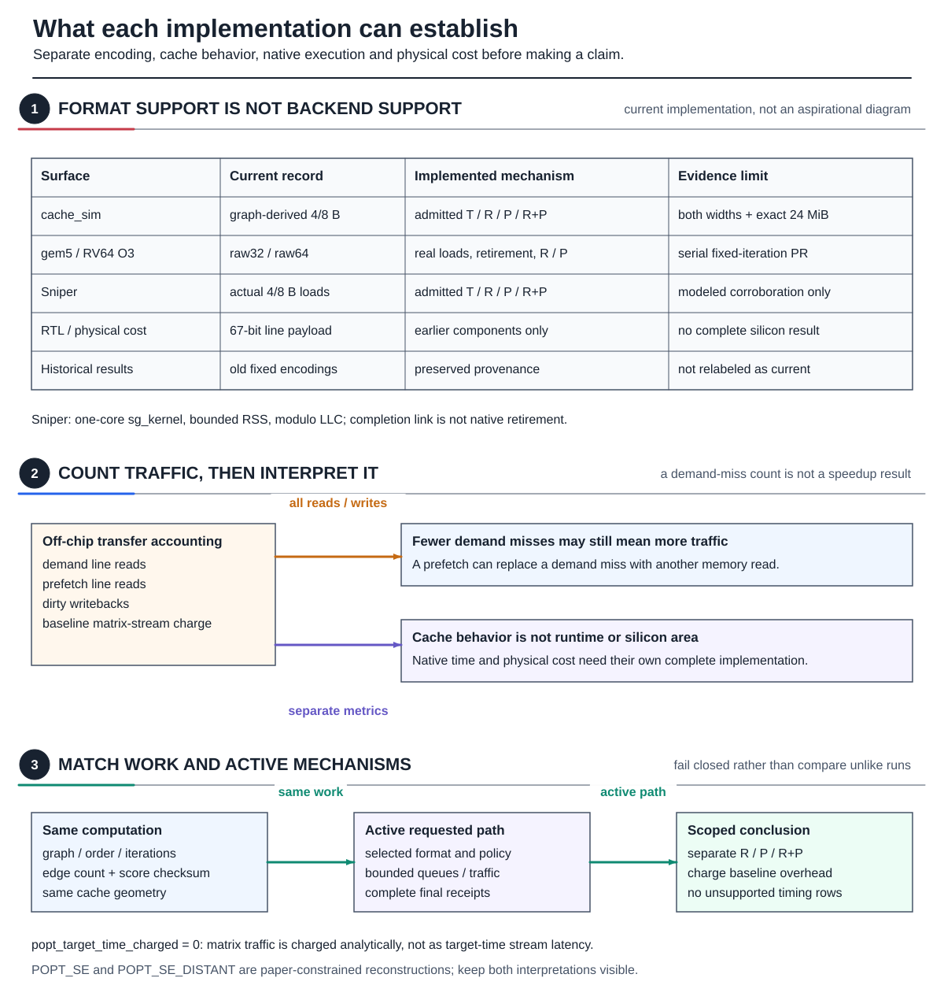

# Evaluation Methodology

The design explanation and the evidence have different jobs. The worked
graph shows how an encoded reference changes a cache decision; experiments
must establish whether that mechanism improves complete workloads at an
accounted cost. This page keeps format, backend, traffic, timing and physical
claims separate.

Current functional and native implementations use one graph-adaptive 4/8-byte
record method. The final paper campaign and complete silicon-area accounting
are not yet claimed. Sections 7.1–7.4 preserve earlier ReusePlan, fixed-format
Twitter, and P-OPT-SE results under their original names and provenance; they
are historical evidence and are not relabeled as current adaptive results.

### Figure 1 — What each implementation can establish



**Figure 1.** A valid layout is not by itself backend evidence. cache_sim and
gem5 use the shared graph-adaptive codec and record-window rule. Native gem5
implements raw32/raw64 loads, retirement, replacement, and acknowledged
LLC-only prefetch; Sniper has strict current-path admission but remains modeled
corroboration. Historical Twitter results are cache/traffic evidence,
not native speedup or physical-area evidence.

## 1. Simulator roles

| Simulator | Current ECG use | Explicit limit |
|---|---|---|
| **cache_sim** | shared adaptive codec, victim rule, real-record window; all four mechanisms admitted at both widths and exact 24 MiB | explicit access-step timing, not CPU cycles or native speedup |
| **gem5 RV64 O3** | raw 4/8-byte loads, per-DynInst association, retirement transport, replacement and acknowledged LLC-only prefetch | serial fixed-iteration PageRank; no final-campaign or physical-area claim |
| **Sniper** | all four mechanisms admitted; 4-byte live virtual and 8-byte SIFT actual-translation paths checked under 4 KiB and exact 24 MiB/16-way geometries | modeled corroboration, not RISC-V architectural timing |

Only gem5 O3 execution time is used for architectural speedup. cache_sim does
not model cycles or instructions. Sniper time is not used as a ReuseBind
speedup metric. Every simulator is compared with its own same-build, same-cell
baseline; absolute miss rates and timing are not compared across simulators.

Current Sniper admission requires `sg_kernel`, one core, uncapped fixed
PageRank, a mandatory process-tree RSS watchdog (default 2,048 MiB), true
modulo LLC indexing, matching work/checksum, and closed update/prefetch/traffic
accounting. It uses actual VA/PA association for only the configured
contribution region. Its update link is bounded completion corroboration—not
retirement—and no current policy remains active after deactivation.
Before the first received watermark it uses the same shared UNKNOWN-state
victim ranking as the other current backends. Prefetch admission uses the
actual current semantic position, and promised record-window bytes are
required rather than silently treated as no candidate.

Current comparisons use the transport-matched loop and require bitwise-equal
checksums. The legacy PageRank loop may differ by one ULP because of FMA
contraction; disabling FP contraction makes the outputs exact, but archived
results are not retroactively relabeled.

The opt-in current equivalence observer fingerprints the actual consumed raw
words, destinations, semantic sequences, normalized states, and deadlines.
Static source-order, carrier, and reference-window digests are prepared outside
ROI and never supply runtime hints. Within one resolved width, the layout and
all these digests must agree across backends and mechanisms. Across widths,
the source order, consumed destination stream, property-read count, and
PageRank checksum must agree; raw words and quantized bounds may differ.
Reference-window selection is not the timing-dependent issued-prefetch stream.
Observer-enabled rows always have `timing_valid_for_speedup=0`, including when
they contain a matching transport control.

`ecg_current_equivalence` makes these semantic checks a bounded first tier:
36 required rows cover the worked fixture and a deterministic pressure graph
at both widths on all three backends. The full-roster receipt is independently
recomputed from raw logs, graph recipes, resolved commands, source files,
binaries, and output hashes. Large accurate cache_sim exploration is separate
and cannot authorize final execution. Detailed final profiles require that
current receipt plus explicit `--final-stage`; small equivalence does not
establish large-graph resource fit or performance.

Layout selection is explicit and bit-granular. It uses the maximum encoded ID,
record count, requested 4/8-byte width, and minimum mantissa precision. A
32-bit VID requires the eight-byte escape. The 26-ID/M6/H31/m0 layout is an
older numeric configuration, not a separate current method. Required bytes
that are not available return `NOT_READY`; no backend may substitute a host
future oracle or certified-prefix fallback.

## 2. Fail-closed row acceptance

An experiment row must establish:

1. requested and effective policy/mode agree;
2. the active structural carrier is the one the workload actually consumes;
3. record width, substitution, and traffic fields agree;
4. FlowThrough activity is positive when requested;
5. P-OPT context, matrix, and phase-two queries are active when required; and
6. semantic output agrees across every policy row in the matched group.

If any matched row fails, group timing is invalid. Memory-order violations,
dependency conflicts, and squashes are O3 diagnostics; semantic receipts decide
architectural correctness.

## 3. Structural FlowThrough fairness

The current ECG comparisons use **FlowThrough off**. The following control
belongs to separately identified placement/transport comparisons.

The `--flowthrough all` control gives LRU, GRASP, P-OPT, and ReusePlan the same
no-allocate opportunity on their actual structural carrier. It is distinct
from request-specific `ECG_FLOWTHROUGH`.

Receipts are backend-specific:

- cache_sim: positive structural accesses;
- gem5: positive structural no-allocate miss targets; and
- Sniper: positive structural read and fill-write counts.

This control removes a policy-specific structural allocation advantage; it does
not equalize record width, matrix traffic, instruction count, or victim
quality.

## 4. Primary quantities

The primary quantities are always reported together:

1. gem5 O3 execution time;
2. total off-chip traffic, including demand, prefetch, metadata, writeback,
   and modeled reference-structure traffic;
3. retired instructions for complete-design comparisons; and
4. policy/mechanism activity receipts.

Per-cell ratios use a matching baseline from the same invocation and build and
are aggregated with a geometric mean. A +/-2% interval classifies a per-cell
ratio as approximately equal. Rows with `timing_valid_for_speedup=0` are
excluded from timing ratios.

### Prefetching and idealized models

With a prefetcher enabled, demand misses alone are not performance evidence:
prefetching may move traffic from demand to prefetch requests. Execution time
and total off-chip traffic remain primary, and MSHR pressure, bandwidth,
queueing, and overfetch must remain visible.

A mechanism with perfect prediction or unlimited latency, bandwidth, queue, or
MSHR resources is reported as an upper bound rather than as measured hardware
performance.

### Instruction-count interpretation

Complete-design comparisons include record layout, transport, ISA, placement,
and replacement, so time, traffic, and retired instructions are interpreted
together. Replacement-only attribution compares transport-matched ReusePlan
policies and requires exact per-cell instruction equality.

For the native ECG mechanism, the transport control runs the same
record/property instruction pair and fixed-iteration loop with replacement and
prefetch application disabled.
ROI instruction counts come from `system.cpu.commitStats0.numInsts` in the
first ROI stats block, not the unreset cumulative `simInsts` field. Matching that work is necessary but does not by itself complete the final
paper campaign.

IPC is derived from instructions and time; it is not independent evidence.
Counterfactual instruction normalization is a sensitivity, not a measurement.

### 4.1 Current sampled preliminary results

The current-method run at `81e7e08f` uses the retained **4,096-vertex samples**,
not the full Patents or Orkut graphs. Every cell executes two complete PageRank
iterations on one core, with automatic record width, FlowThrough off, no extra
prefetcher, and the equivalence observer disabled. The declared pressure
hierarchy is 4 KiB L1D / 8 KiB L2, both eight-way, and 16 KiB / 16-way LLC.
This scaled hierarchy exposes mechanisms on small graphs; it is not a
final-paper hardware configuration.

The layouts themselves show why VID width must follow actual encoded IDs:

| Sample | Records | Maximum encoded VID | VID / metadata bits | Horizon / mantissa bits | Record bytes |
|---|---:|---:|---:|---:|---:|
| Patents-4096 | 3,449 | 659 | 10 / 22 | 12 / 17 | 4 |
| Orkut-4096 | 20,956 | 4,095 | 12 / 20 | 15 / 15 | 4 |

Both graphs declare 4,096 vertices, but the Patents pull stream never encodes
IDs above 659. Its high-ID sinks and isolated vertices do not force unused VID
bits into the records. Across all three backends, the source stream is retained:
Patents uses 13,796 carrier bytes and 1,816 peak auxiliary bytes; Orkut uses
83,824 carrier bytes and 10,248 peak auxiliary bytes. These carrier allocations
are additional to the retained graph, not an in-place memory saving.

The native comparison uses `ECG_TRANSPORT` as the denominator: the same
record/property instruction loop with replacement and prefetch application
disabled. The combined `ECG` results are:

| Sample | Transport ROI cycles | ECG ROI cycles | Native speedup | Transport off-chip bytes | ECG off-chip bytes |
|---|---:|---:|---:|---:|---:|
| Patents-4096 | 331,681 | 277,889 | 1.194x | 288,448 | 273,088 |
| Orkut-4096 | 853,144 | 672,983 | 1.268x | 479,872 | 357,248 |

Native off-chip bytes fall by 5.3% and 25.6%, respectively, including the
modeled read/write traffic. These are ROI comparisons, excluding graph loading
and record construction. They do not establish an end-to-end gain over an
ordinary CSR implementation or a full literature-baseline comparison.

Reported LLC miss counters (`l3_misses`) remain backend-local:

| Backend | Sample | Transport misses | ECG misses | Miss reduction |
|---|---|---:|---:|---:|
| cache_sim | Patents-4096 | 3,682 | 3,353 | 8.9% |
| cache_sim | Orkut-4096 | 6,482 | 4,417 | 31.9% |
| gem5 RV64 O3 | Patents-4096 | 3,507 | 3,029 | 13.6% |
| gem5 RV64 O3 | Orkut-4096 | 6,467 | 2,125 | 67.1% |
| Sniper | Patents-4096 | 3,670 | 3,798 | -3.5% |
| Sniper | Orkut-4096 | 6,593 | 5,293 | 19.7% |

The Sniper Patents regression is retained, not filtered out. It issues no
prefetch requests in this cell; Orkut issues 12,352 prefetch-request bytes.
The current Sniper row export does not provide aggregate off-chip bytes, so
these rows support no aggregate-traffic or native-speedup claim. Functional
cache_sim read/write-plus-prefetch transfers fall by 12.1% on Patents and
29.0% on Orkut; they are cache/traffic results, not CPU speedups.

All policies/backends execute 6,898 property reads for Patents and 41,912 for
Orkut, with respective score checksums `f157f41979260953` and
`0b81a45f0ea94bbe`. The 12 uninstrumented rows, per-cell commands, raw receipts,
and completed output digests are under
`results/ecg_experiments/runs/current_preliminary/`; the generated
`preliminary_summary.json` is explicitly non-authorizing.
The refreshed 36-row semantic receipt is separately retained under
`results/ecg_experiments/runs/ecg_current_equivalence_preliminary/`.
The preliminary run took 585.786 host seconds and peaked at 964.137 MiB sampled
process-tree RSS under a 2,048 MiB guard. These small-sample results motivate
larger evaluation; they do not replace it.

### 4.2 Ordinary CSR baseline qualification

New full-graph comparisons use `--current-pr-baselines` in cache_sim.
The ordinary CSR path and the current encoded-record path share one fixed
pull-GS loop, separate F32 multiply/add semantics, and the same warm-up.
Both explicitly account for two incoming-index reads and two outgoing-index
reads per vertex per iteration. CSR uses the source IDs directly; ECG reads
its separately allocated four/eight-byte carrier. P-OPT's reference matrix
and its simulated column traffic remain additional costs.

This distinction matters: the older CSR loop omitted those index accesses
from its functional trace, and host FMA contraction could change its checksum.
Those older rows are preserved with their original provenance; they are not
silently mixed with current end-to-end comparisons. Current fixed-workload
receipts bind graph/work counts, input carrier, arithmetic, and the index-read
count, and all compared rows must have the same PageRank result.

### 4.3 Full-core local release results

The local release run at `8d50ec7c` completed all **60 cache_sim cells**:
six full core graphs, ten policy/control roles, two complete PageRank
iterations, automatic record width, and an 8 MiB / 16-way LLC.
L1D is 32 KiB and L2 is 256 KiB, both eight-way. The retained corpus
preparation's symmetrization and DBG ordering are unchanged. All ten roles
agree on graph work and score checksum within each graph.

Unlike the small preliminary samples, these layouts exercise mantissas from
three through six bits. Every full core graph selects a four-byte carrier:

| Full graph | Records | VID / metadata bits | Horizon / mantissa bits |
|---|---:|---:|---:|
| web-Google | 8,644,102 | 20 / 12 | 24 / 6 |
| roadNet-CA | 5,533,214 | 21 / 11 | 23 / 5 |
| cit-Patents | 33,037,894 | 22 / 10 | 25 / 4 |
| soc-pokec | 44,603,928 | 21 / 11 | 26 / 5 |
| soc-LiveJournal1 | 85,702,474 | 23 / 9 | 27 / 3 |
| com-Orkut | 234,370,166 | 22 / 10 | 28 / 4 |

The table reports the combined ECG reduction in total modeled off-chip
line transfers, including reads, writebacks and prefetch traffic. P-OPT is the
size-correct charged comparison with its column stream simulated. Positive
values mean less traffic; negative values mean a regression.

| Full graph | Versus CSR LRU | Versus GRASP_PAPER | Versus charged P-OPT |
|---|---:|---:|---:|
| web-Google | 3.97% | -19.18% | 12.27% |
| roadNet-CA | 28.48% | 16.38% | 40.80% |
| cit-Patents | 48.08% | 19.48% | 22.59% |
| soc-pokec | 25.23% | 0.80% | 20.01% |
| soc-LiveJournal1 | 39.08% | 15.87% | 20.46% |
| com-Orkut | 38.39% | 24.15% | 11.58% |

ECG reduces traffic versus LRU and charged P-OPT on all six graphs.
Against GRASP_PAPER, the frozen +/-2% rule gives four wins, one tie, and one
loss. **The web-Google traffic regression is retained.** Geometric-mean
ECG/baseline traffic ratios are 0.6814 against LRU, 0.8933 against GRASP_PAPER,
and 0.7806 against charged P-OPT; these are not CPU speedups.

Replacement drives most of the traffic reduction. Prefetching additionally
reduces reported misses on several graphs with nearly unchanged traffic.
For example, Patents replacement-only reports 11,961,350 LLC misses and
12,865,017 off-chip transfers; combined ECG reports 11,216,846 misses and
12,865,128 transfers. Whether that shift improves target time remains a
detailed-simulation question.

The complete matrix, per-policy raw outputs, completion receipts and generated
`local_release_summary.json` are retained under
`results/ecg_experiments/runs/local_release_cache/`. The serial run took
6,734.789 host seconds (about 1 hour 52 minutes) and peaked at 1,994.219 MiB
sampled process-tree RSS, below the 8,192 MiB cap.
This establishes local full-core functional readiness at the primary capacity.
It does not cover current-method Twitter, a 24 MiB sweep, eight-byte
full-graph performance, large native timing, or physical area/energy.

## 5. P-OPT accounting

Analytic P-OPT charges reserved LLC capacity and cumulative matrix traffic. It
sets `popt_target_time_charged=0`, so matrix-stream latency is omitted, as are
target-time lookup latency, target-time bandwidth, queueing, and contention.
Its timing is therefore an optimistic P-OPT bound, specifically a lower bound
on time, not a realistic target-time implementation.

The reference matrix assumes an ordered sweep. Final reference rows are
limited to PageRank and Connected Components. BFS and SSSP comparisons are
project extensions: frontier order does not satisfy P-OPT's monotonic
sweep-order epoch assumption, so those rows remain diagnostic.

The two resident columns are current and next. Initial loading belongs to
cumulative stream traffic, not a third resident column.

`size_correct` scales the reservation with both the graph and LLC rather than
assuming that "two columns" means two cache ways:

```
column_bytes = ceil(vertices * property_bytes / line_size)
reserved_ways = ceil(2 * column_bytes / bytes_per_way)
```

This matches the pinned P-OPT artifact's `registerOffsetMatrix()` rule: for
PageRank, `m_startWay` is the ceiling of two irregular-data columns divided by
one way's capacity, and ordinary data replacement considers only ways
`m_startWay..15`. The charged row is therefore a scalability projection for
the evaluated graph and LLC, not a claim that every P-OPT experiment reserves
a fixed two ways.

For Twitter-2010 at the primary 8 MiB, 16-way LLC, one column is 2,603,265
bytes and the two resident columns require 10 ways, leaving six data ways.
Full-capacity uncharged P-OPT records 371,203,581 LLC misses, 18.0% fewer than
LRU's 452,625,102, so the replacement policy itself remains beneficial.
Size-correct charged P-OPT records 483,462,525 demand misses; the loss of ten
data ways accounts for the large gap, while the complete 256-column stream
adds another 10,413,060 miss-equivalent transfers. Charged P-OPT being worse
than LRU at this Twitter/8 MiB design point is thus a scaling result, not a
contradiction of P-OPT's results on different graph/cache ratios.

### 5.1 GRASP paper baseline

`GRASP_PAPER` preserves the upstream trace simulator's PageRank mapping:
each registered property region receives a high-reuse boundary equal to 50%
of LLC capacity, with the moderate boundary at twice that allocation. It is
separate from the older `GRASP` array-relative 15% sensitivity retained for
historical result compatibility.

At upstream GRASP commit `6e3814430265fc4f2513c95ef131a6522bc9d389`,
the official 1 MiB, 16-way web-Google PageRank trace contains 9,887,515
accesses. After the artifact's missing-return undefined behavior is repaired
with one `return 0`, the official simulator reports 8,687,691 LRU misses and
6,397,965 GRASP misses. `grasp_trace_replay` reproduces both counts exactly;
its optional empty-way behavior is confined to artifact replay because the
official trace simulator may replace a cold line while invalid ways remain.
Normal cache_sim, gem5, and Sniper retain real-cache invalid-way-first fills.

### 5.2 Single-epoch P-OPT reconstruction

The [P-OPT paper](http://brandonlucia.com/pubs/POPT_HPCA21_CameraReady.pdf),
Section VII-B, describes P-OPT-SE with one current-epoch column, bit 7
distinguishing current-epoch presence, bit 6 indicating next-epoch presence,
and six payload bits. The pinned public artifact does not implement SE. The
paper also leaves unspecified the returned rank after the current epoch's
last use when the next-epoch flag is clear. These rows are therefore
paper-constrained reconstructions, not bit-exact reproductions of Figure 11.

`POPT_SE` groups that unspecified later-use case at rank 2.
`POPT_SE_DISTANT` instead assigns rank 63. Both use 64 subepoch bins,
return rank 0 before or within the last-use subepoch and rank 1 for an
upcoming next-epoch use, and decode absent-current-epoch distances from six
bits. After the final epoch's last use they return 63. Neither decoder reads
the next column. Both interpretations must be reported; their miss counts
are not formal upper and lower bounds.

SE is initially supported only by serial cache_sim PageRank with 4-byte
properties, 64-byte lines, and 256 epochs. Other backends and geometries fail
closed. The runner pins one active column and size-correct capacity charging
per SE row without changing ordinary P-OPT rows in the same matrix.
`:UNCHARGED` is available as a separate replacement-quality diagnostic.
An accepted SE row requires its encoding and post-final-rule receipt and the
same PageRank semantic result as every other policy in its group.

One-column residency does not halve the backing matrix or its cumulative
stream. Twitter still has 666,435,840 logical backing bytes and 256 streamed
columns per complete traversal. SE's 2,603,265-byte active column reserves
5, 3, and 2 ways at 8, 16, and 24 MiB respectively, versus full P-OPT's
10, 5, and 4 ways. This differs from the old two-way diagnostic, which
retained full two-column encoding and lookup without paying its capacity.

Cost domains remain separate: `popt_backing_matrix_bytes` is the complete
matrix in memory, `popt_matrix_bytes` is active-column payload, and
`popt_reserved_bytes` is the whole-way LLC reservation. ECG's current 67-bit
per-line prediction payload is on-chip logical state, separate from queues,
ports, validation, tags, data and recency. Ratios against the complete P-OPT
matrix are total metadata-footprint ratios, not silicon-area savings.
Area comparisons must charge every current ECG state and control structure.
`total_offchip_traffic_with_overhead` includes reads, writebacks, and any
analytic matrix stream; demand LLC misses are reported separately.

## 6. Earlier workload and campaign roles

These assignments describe retained historical studies. They do not imply
that the current native path supports every listed kernel. Current native
execution is serial fixed-iteration PageRank; functional and modeled backends
have different evidence scopes.

The literature-scale PageRank screen uses fixed 262,144-vertex samples of
web-Google, Pokec, Patents, roadNet-CA, LiveJournal, and Orkut at iteration
counts 1 and 8. Its hashes, geometries, policy roles, and decision thresholds
are in `pagerank_literature_scale.json`.

The earlier three-graph sensitivity study uses web-Google, soc-pokec, and
cit-Patents. Iteration counts are 1, 2, 4, and 8. Its configuration is
[`pagerank_study.json`](https://github.com/UVA-LavaLab/ECG_GrAPL/blob/main/scripts/experiments/ecg/configs/pagerank_study.json).

The publication corpus must include web-Google, Pokec, Patents, roadNet-CA,
LiveJournal, and Orkut; Twitter-2010 is the cache-only stress case.

- gem5 O3 supplies compact PageRank architectural timing.
- cache_sim supplies full-graph all-kernel replacement and traffic.
- Sniper supplies bounded matched-work cache/traffic corroboration.

Selector generations 1 and 2 did not satisfy the retained representativeness
and regret checks. They are retained as negative diagnostics and must not be
presented as detailed-simulator performance policies.

## 7. Historical campaign provenance

Sections 7.1–7.4 retain earlier replacement, transport, fixed-format Twitter,
and P-OPT-SE campaigns. Their policy labels, values, hashes and conclusions
are preserved exactly as provenance. They are not current adaptive-method
results, and their receipts do not transfer to the current implementation.

### 7.1 Replacement campaign

The literature-scale replacement campaign compares ReusePlan victim selection
against SRRIP, GRASP, and P-OPT under `pagerank_literature_scale.json`. Its
screen decision stands at STOP, so it supports no ReusePlan replacement claim
against those baselines. That decision remains the authoritative record for
replacement, and its configuration, thresholds, and stages are frozen. Rows and
receipts produced under earlier commits are not admissible evidence for either
campaign.

### 7.2 Transport campaign

The transport campaign isolates compact ReusePlan record transport and
structural FlowThrough while replacement stays pure LRU. Its configuration is
`transport_literature_scale.json`; its manifest profile is
`reuse_plan_transport_campaign`.

- The comparison is `LRU` against `ECG_REUSE_PLAN_LRU_FLOWTHROUGH`. Both arms
  select victims with LRU and both run `--flowthrough all`, so structural
  FlowThrough is symmetric and only graph representation, request path, and
  record transport differ.
- Timing uses the same six 262,144-vertex PageRank samples, geometries, and
  iteration-1/iteration-8 semantic receipts as the replacement screen, with
  gem5 O3, the computed-address compact trace-free path, 16 epochs, 2 tier
  bits, 4-byte records, and no prefetcher.
- Full-graph 8-byte and 4-byte cache_sim roles are matched cell for cell over
  `pr`, `bfs`, `bc`, and `cc` on the five compact-eligible graphs.
  `soc-LiveJournal1` is excluded from this width comparison because its full
  graph needs 23 destination bits, and `23 + 2 + 4 + 4 = 33` does not fit a
  32-bit record.
- Bounded matched-work Sniper rows with 8-byte records corroborate demand LLC
  load misses only. Sniper does not expose byte-level off-chip traffic for
  this role, and its LLC load-miss count excludes writeback bytes.

Admissible claims are limited to transport and placement: PageRank execution
time and off-chip traffic against an identical LRU cell, full-graph record
substitution at 4 bytes against the matched 8-byte control on the five
compact-eligible graphs, and Sniper demand-LLC-miss non-regression. No
replacement-policy claim, no comparison against SRRIP, GRASP, or P-OPT, no
Sniper byte-traffic claim, no hardware-cost claim, and no timing claim from
Sniper or from the mechanism stage may be drawn from it.

This is a confirmatory campaign, not a first observation. Earlier symmetric
iteration-1 rows at commit `14b82753` already contained the same LRU transport
control; they informed the transport-only scope but are excluded from the new
campaign evidence. The configuration records those prior ratios explicitly.
The new thresholds use the existing frozen +/-2% tie band rather than being
selected from the confirmatory rows: an aggregate ratio of at most 0.98 is
required for a positive timing or compact-width claim, while 1.02 is the
maximum material-regression bound.

The screen therefore requires an aggregate geometric-mean time ratio of at
most 0.98 and an aggregate traffic ratio of at most 1.02, with every per-cell
time and traffic ratio at most 1.02. The complete phase repeats those limits at
iteration 8, requires an aggregate compact/wide off-chip traffic ratio of at
most 0.98 with per-cell traffic and LLC-miss ratios at most 1.02, and requires
Sniper aggregate and per-cell demand-LLC-miss ratios at most 1.02.

Configuration version 2 records one validation amendment discovered before
any full cache role was accepted. When `--flowthrough all` is active, the
common structural no-allocate path intentionally supersedes the candidate's
duplicate static record no-allocate path. cache_sim now records that
subsumption explicitly and accepts it only when structural FlowThrough is
active with positive accesses. The first screen receipt and attempted full
cache run are invalidated by the configuration amendment; no threshold,
policy, stage, or claim changed.

Configuration version 3 records a second validation amendment discovered in
the first Sniper role. Distinct per-edge records may target different vertices
within one property cache line and legitimately carry different future hints.
The Sniper fused sideband now preserves all destination records and binds the
certified prefix by current source plus the original bound property address,
rather than collapsing records by source and cache line. The marker-free
post-prefix lookup remains line-granular, but the Sniper role uses pure LRU
replacement and supplies no admissible timing, so those hints cannot affect
the campaign's victim choice. All version-2 screen and full-role evidence is
invalidated; thresholds, policies, stage roster, and admissible claims remain
unchanged.

### 7.3 Historical fixed-format scalability

> **Historical result boundary.** This section preserves the original
> `ECG_REF32_*`, Full14 and Scale6 terminology, measurements, hashes and
> accounting from the recorded revision. These names are not public formats
> of the current adaptive method.

`ECG_REF32_RP_COMMIT` is a separate candidate that returns to the original ECG
goal: improve cache behavior relative to GRASP and P-OPT without retaining
P-OPT's runtime rereference matrix.

The Full14 profile for certified n18 DBG-ordered PageRank graphs uses an
18-bit destination, an 8-bit forward property-line reference, a 2-bit
finite/dead/wrap/unknown state, and a 4-bit forward-record prefetch action.
Smaller graphs use their actual ID width, leaving additional unused padding;
the metadata budget does not automatically grow past fourteen bits. The
reference uses five exponent and three mantissa bits. A configured 21-bit
per-line deadline must cover the recorded traversal's safe half-range.
A passed prediction becomes UNKNOWN, never DEAD.

Graphs requiring more than 18 ID bits cannot use Full14. The large-graph
campaign explicitly selects **Scale6** and forces its 26-bit ID field:
one six-bit token represents state and coarse future distance, with no
independent action field. The same encoding can be forced on small graphs as
a format qualification/control; that does not make Scale6 the only ECG format.
Its prefetch target is derived from the 16-record window, and the campaign uses
a 32-bit semantic deadline plus state and prefetch origin per LLC line.

Private-cache hits update LLC metadata through a bounded commit-only channel:
16 entries, eight governed requests of latency, one update per governed request,
and cache-line coalescing. The selective prefetch path has eight pending entries,
the same eight-request latency, one issue per eight governed requests, and an
LLC-only fill. It reads the selected destination from a 16-record lookahead
buffer, rejects resident or pending duplicates, and checks replacement
admission before issuing.

The record substitutes for the ordinary 4-byte CSR destination access and has
no separate per-edge metadata sidecar. Full14's functional carrier is separately
allocated; the in-place Scale6 path avoids another edge array. At a
512 KiB, 64-byte-line LLC, the Full14 default's accounted added state is 24 bits per
line plus the two bounded queues, 16-record lookahead buffer, and control state:
199,232 bits total. The corresponding n18, 256-epoch P-OPT matrix is 33,554,432
bits, a 168.4x reduction before counting P-OPT's reserved LLC capacity.

At Twitter-2010 scale (41,652,230 vertices, 1,468,364,884 edges) and an 8 MiB
LLC, scale6 accounts for about 560 KiB of LLC/control state. P-OPT's
256-epoch matrix is about 635.6 MiB, a 1,161x reduction. The packed Twitter
record stream remains the original four bytes per edge; no sidecar is added.

Before full Twitter conversion, the Scale6 format was forced onto all six n18
graphs with a virtual 26-bit ID width. Promotion required every graph to beat
full-capacity P-OPT in LLC misses, aggregate traffic no worse than P-OPT, and
validated 32-bit record, 32-bit deadline, bounded-channel, prefetch, and
resource receipts. Full Twitter evidence was a separate gate, completed below.

The certified Twitter gate completed on graph SHA-256
`7942eb7fb4376e66f2e0e0a569e6d1093659d9949e24d899d02509674d828be3`.
All seven policies executed one complete sweep of 1,468,364,884 directed
edges and produced score checksum `df4fdaf1e3957ce9`.

At an 8 MiB, 16-way LLC, scale6 replacement-only records 326,257,584
LLC misses. The combined replacement-plus-prefetch policy records 292,056,469:
35.5% fewer than LRU, 32.1% fewer than SRRIP, 23.2% fewer than
`GRASP_PAPER`, and 21.3% fewer than full-capacity uncharged P-OPT. Its
off-chip traffic is 12.1% below uncharged P-OPT.

The combined row issues 34,273,001 prefetches, of which 34,200,921 are useful.
The commit and prefetch queues report zero capacity drops, with maximum
occupancies of eight and one entries respectively. Accounted REF32 state is
4,590,584 bits versus 5,331,486,720 bits for the 256-epoch P-OPT matrix, a
1,161.4x reduction. The authoritative matrix is
`results/ecg_experiments/runs/twitter_ref32_7669a3aa/roi_matrix.json`
(SHA-256 `610cc706b51d65aabb1a22dee652669e8a75ca1783e24abf223990ca89a1c48f`).

To expose a configuration where the size-correct P-OPT charge remains
beneficial, the same seven-policy Twitter matrix was also run at a 16 MiB,
16-way LLC. The two resident P-OPT columns then reserve five ways and leave
eleven data ways:

| Policy | LLC misses | Reduction versus LRU |
|---|---:|---:|
| LRU | 388,828,693 | -- |
| SRRIP | 365,844,751 | 5.9% |
| `GRASP_PAPER` | 314,999,063 | 19.0% |
| Full-capacity uncharged P-OPT | 296,111,526 | 23.9% |
| Size-correct charged P-OPT | 340,362,063 | 12.5% |
| Scale6 replacement-only | 265,597,230 | 31.7% |
| Scale6 replacement + prefetch | 238,918,842 | 38.5% |

Thus charged P-OPT beats both LRU and SRRIP at this capacity. Adding its
10,413,060 analytic matrix-stream reads to 341,476,852 raw off-chip transfers
gives 351,889,912 transfers, 9.8% below LRU. Scale6 combined records
266,758,802 off-chip transfers, 24.2% below that matrix-inclusive charged
P-OPT value and 10.3% below uncharged P-OPT.

Scale6 replacement-only remains 10.3% below full-capacity uncharged P-OPT in
LLC misses, while combined Scale6 is 19.3% below uncharged P-OPT and 29.8%
below charged P-OPT. Both bounded queues report zero drops. Accounted Scale6
state is 9,178,104 bits, a 580.9x reduction from P-OPT's complete matrix. The
seven rows again report one iteration, 1,468,364,884 semantic edges, and
checksum `df4fdaf1e3957ce9`. The complete 16 MiB matrix is
`results/ecg_experiments/runs/twitter_ref32_16mb_2dbb6680/roi_matrix.json`
(SHA-256 `608370f0d2a9dd72d8319bcadfee2837c1a58bc34da734dc520d90d418f0a0e5`).

The P-OPT paper's baseline LLC is 3 MiB per core across eight cores: 24 MiB,
16-way. Its non-power-of-two set mapping uses modulo indexing. Section VII-B
and Figure 11 explicitly scale the reserved-way count with graph size: full
two-column P-OPT uses two ways near 18--21 million vertices, three ways at
32 million, and four ways near 40--43 million. Twitter's 41,652,230 vertices
therefore require four ways at 24 MiB, not two.

The 24 MiB LLC comparison retains the project's 128 KiB L2, rather than the
paper's 256 KiB L2; it is not a complete reproduction of the paper's system.
The Twitter matrix gives:

| Policy | LLC misses | Reduction versus LRU |
|---|---:|---:|
| LRU | 348,781,423 | -- |
| SRRIP | 324,925,497 | 6.8% |
| `GRASP_PAPER` | 276,638,624 | 20.7% |
| Full-capacity uncharged P-OPT | 252,862,518 | 27.5% |
| Size-correct four-way P-OPT | 286,310,073 | 17.9% |
| Scale6 replacement-only | 230,428,305 | 33.9% |
| Scale6 replacement + prefetch | 208,422,358 | 40.2% |

At this graph size, charged two-column P-OPT has 3.5% more demand LLC misses
than `GRASP_PAPER`. Including 10,413,060 matrix-stream transfers raises its
miss-equivalent total to 296,723,133, 7.3% above GRASP. This does not
contradict the paper: Twitter was not one of its inputs, and Section VII-B
identifies the growing metadata reservation as the large-graph limitation.

An explicitly infeasible two-way sensitivity retains the 24 MiB cache's 24,576
sets but exposes 14 data ways. It records 268,219,327 demand misses, 3.0% fewer
than GRASP. The two ways hold only 3,145,728 bytes, however, while Twitter's
two active columns require 5,206,530 bytes. After adding the same matrix
stream, the sensitivity reaches 278,632,387 miss-equivalent transfers, 0.7%
above GRASP. It is not a valid full P-OPT result. The paper's valid
lower-footprint alternative is P-OPT-SE, which stores one column and changes
the metadata encoding and replacement information; it must be evaluated as a
separate policy rather than represented by undercharging full P-OPT.

Scale6 combined has 24.7% fewer LLC misses than GRASP, 27.2% fewer than
size-correct charged P-OPT, and 17.6% fewer than full-capacity uncharged P-OPT.
Replacement-only Scale6 also beats GRASP by 16.7% and uncharged P-OPT by 8.9%.
The authoritative 24 MiB matrix is
`results/ecg_experiments/runs/twitter_ref32_24mb_6a1b9f29/roi_matrix.json`
(SHA-256 `a145ba982e8fcfaa198899382f7c026606a58647aa0d5b642b20d2d75a708d0d`).
The two-way diagnostic is
`results/ecg_experiments/runs/twitter_popt_24mb_fixed2_sensitivity/roi_matrix.json`
(SHA-256 `7dfbc7c7ff2c9104a6bc095694842a88023a86c78e804f13896eb364b0a77a53`).

These historical REF32 rows were accepted only when the graph filename
certified DBG order, the
record/commit/prefetch/resource receipts validate, no runtime P-OPT matrix is
present, semantic output matches, both queues drain, and the record remains four
bytes. Cache-simulator LLC misses, governed-property misses, and off-chip
traffic are the admissible evidence from that campaign. They do not become
native timing evidence after later implementation work.

### 7.4 Historical completed single-epoch baseline qualification

The fresh nine-policy Twitter matrix covers both the primary 8 MiB LLC and
the 24 MiB sensitivity. All 18 rows execute one traversal of 1,468,364,884
directed edges and produce checksum `df4fdaf1e3957ce9`. The seven pre-existing
policies reproduce their earlier demand, governed-property and off-chip
counts exactly. Both SE interpretations retain one-column lookup and the
full 256-column stream charge.

| Policy | 8 MiB demand LLC misses | 24 MiB demand LLC misses |
|---|---:|---:|
| LRU | 452,625,102 | 348,781,423 |
| SRRIP | 430,424,534 | 324,925,497 |
| `GRASP_PAPER` | 380,297,603 | 276,638,624 |
| Full-capacity uncharged P-OPT | 371,203,581 | 252,862,518 |
| Size-correct two-column P-OPT | 483,462,525 | 286,310,073 |
| `POPT_SE` (later-use rank 2) | 417,444,706 | 272,165,897 |
| `POPT_SE_DISTANT` (later-use rank 63) | 417,443,375 | 272,062,815 |
| Scale6 replacement-only | 326,257,584 | 230,428,305 |
| Scale6 replacement + prefetch | 292,056,469 | 208,422,358 |

At 24 MiB, the one-column SE reconstruction legitimately fits in two reserved
ways and has 1.65% fewer demand misses than GRASP under the distant
interpretation. That small demand advantage is not a total-traffic advantage:
including matrix reads and dirty writebacks, it produces 2.13% more off-chip
transfers than GRASP. At 8 MiB it reserves five ways and reduces demand misses
by 7.77% versus LRU, but remains above GRASP.

The table below counts 64-byte off-chip transfers in both directions, with
the analytic matrix stream included exactly once:

| LLC | GRASP | Two-column P-OPT | `POPT_SE` | `POPT_SE_DISTANT` | Scale6 combined |
|---|---:|---:|---:|---:|---:|
| 8 MiB | 381,391,613 | 494,991,582 | 428,973,438 | 428,972,096 | 327,430,796 |
| 24 MiB | 277,675,539 | 297,835,461 | 283,689,831 | 283,586,671 | 231,580,310 |

Against the better of the two SE interpretations, Scale6 combined has
30.0% fewer demand misses and 23.7% less off-chip traffic at 8 MiB; at 24 MiB
the reductions are 23.4% and 18.3%. Replacement-only Scale6 reduces demand
misses by 21.8% and 15.3% respectively. Both interpretations are retained
rather than selecting a favorable reconstruction: their demand-miss spread
is only 0.000319% at 8 MiB and 0.037889% at 24 MiB.

The SE comparison therefore does not overturn the Scale6 cache-quality
result. It does not establish native speedup or silicon-area savings.
Both Scale6 channels drain with zero capacity drops. The authoritative
18-row matrix is
`results/ecg_experiments/runs/twitter_popt_se_d9ae0a6c/roi_matrix.json`
(SHA-256 `6ee0e0c21bf582f55b0ef6a4c1d8c7544348558eaccc7b4cb9454c6352b2e124`).
The associated completion receipt records all 18 rows as successful.

## 8. Publication policy

Preliminary numbers and intermediate choices remain local. Publish complete,
provenance-backed results only for the claim their campaign establishes.
The completed historical matrices above support their scoped functional
cache/traffic claims. The current native mechanisms have separate qualification
receipts, but the final paper campaign is not complete. Energy and silicon-area
claims require separate physical implementation and qualification; failed or
infeasible diagnostics are never promoted into results.

Passing the admitted workload and protocol gates is not a proof of bug
freedom outside their scope. Novelty claims must identify the contribution
beyond the authors' ECG 2024 predecessor and the closest published comparators,
not claim that graph-guided caching itself is new.
Current logical bit counts and a functioning simulator also do not establish
low hardware area, energy, or critical-path overhead; those claims require
current-design physical evidence, including the assumed ports and queue
saturation behavior.
