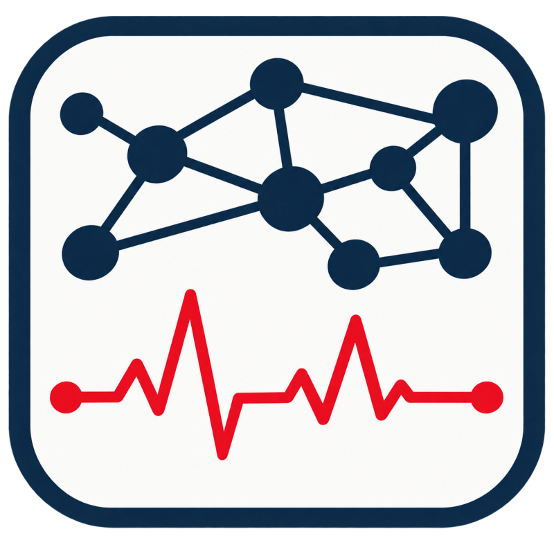

  

# ECG Next Documentation

ECG Next combines compact ReusePlan records, exact ReuseBind request binding,
and FlowThrough placement for irregular graph analytics.

## Start here

- [ReusePlan and FlowThrough](ReusePlan-FlowThrough) — architecture, record layout,
  request path, and worked examples.
- [RISC-V instruction path](RISC-V-Instruction-Path) — instruction family,
  operands, pipeline stages, request construction, and cache behavior.
- [Evaluation methodology](Evaluation-Methodology) — workloads, baselines,
  simulator roles, and reporting rules.
- [Build and reproduction](Reproduction) — graph preparation, builds,
  tests, and experiment commands.
- [Repository hygiene](Repository-Hygiene) — tracked source and local-only
  artifacts.

Performance tables will be added after the final evaluation.
