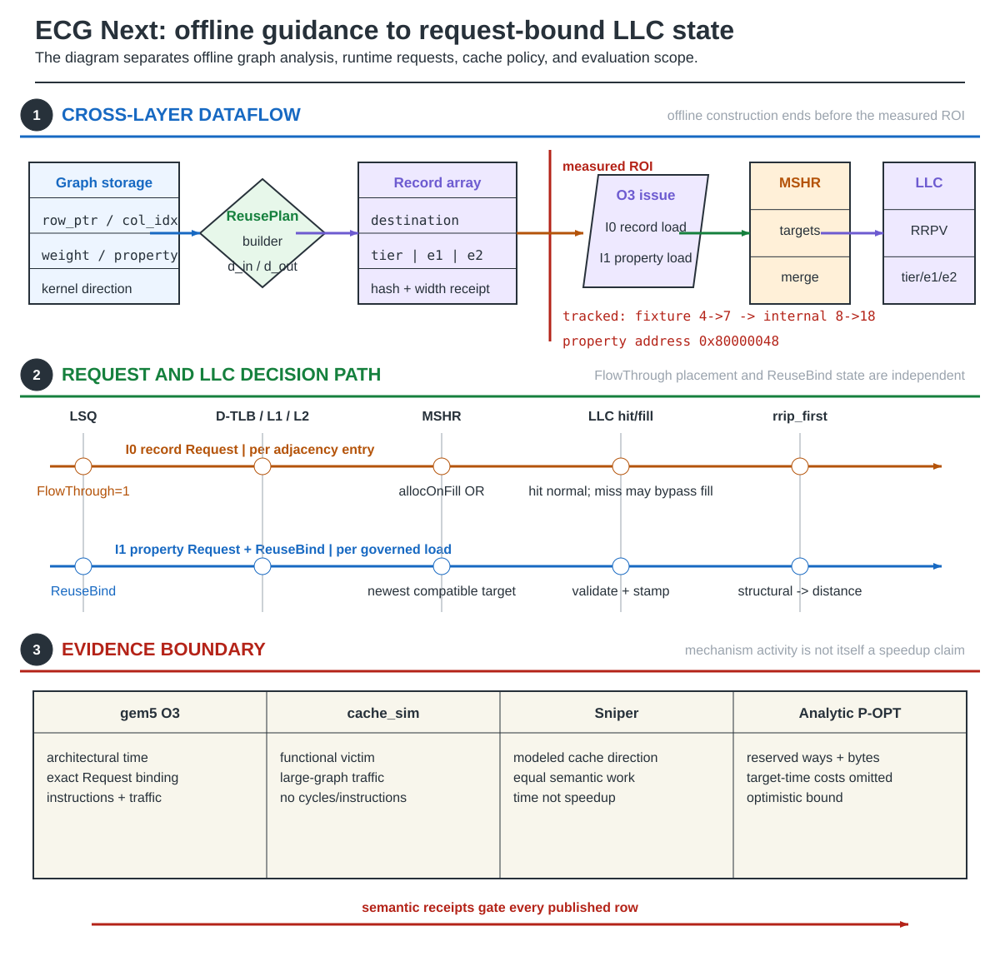

  

# ECG Scale6

The current ECG candidate packs graph-derived future reuse into the existing
four-byte edge stream. **Scale6** uses a 26-bit property vertex and six-bit
future token, with line-local LLC state, bounded commit refresh, and selective
LLC-only prefetching. Property values and graph results are unchanged.

### Figure 1 — Scale6: future reuse in the existing edge word

**Figure 1.** Offline construction, demand data, commit refresh and prefetch
are separate paths. The current cache_sim model supports full-graph cache and
traffic evidence. It does not establish processor-cycle timing or physical area.

For PageRank pull, the outer vertex traverses in-neighbors `N_in(u)`, and the
record names the property vertex whose contribution is read. Other graph
traversals need metadata for their own actual request order; frontier-based
kernels do not automatically inherit this fixed-sweep result.

## Current status

Full Twitter-2010 demonstrates that the four-byte format reaches 26-bit graph
IDs. The 8 MiB LLC remains the primary target; 16 and 24 MiB are additional
capacity points. P-OPT-SE is a separately labeled reconstruction, not an
undercharged ordinary P-OPT row.

The native Scale6 record/F32 pair, retirement-only transport and separate
LLC replacement policy are implemented in RISC-V O3 and under qualification.
This replacement-only integration does not establish the complete design:
native prefetch, the production timing gate and physical-cost evidence remain
closed. The earlier ReuseBind implementation is a separate mechanism.

## Documentation

1. [Scale6 records and cache control](ReusePlan-FlowThrough) derives the token,
   future bound, update path, prefetch window and capacity accounting.
2. [RISC-V integration](RISC-V-Instruction-Path) distinguishes existing
   ReuseBind support from native Scale6 replacement and the remaining work.
3. [Checked edge-to-cache example](Property-to-Cache-Walkthrough) follows a
   concrete word, property address, cache line and expiry.
4. [Evaluation methodology](Evaluation-Methodology) separates demand misses,
   all off-chip traffic, timing, and storage cost.
5. [Reproduction](Reproduction) contains the supported build and experiment
   commands.
