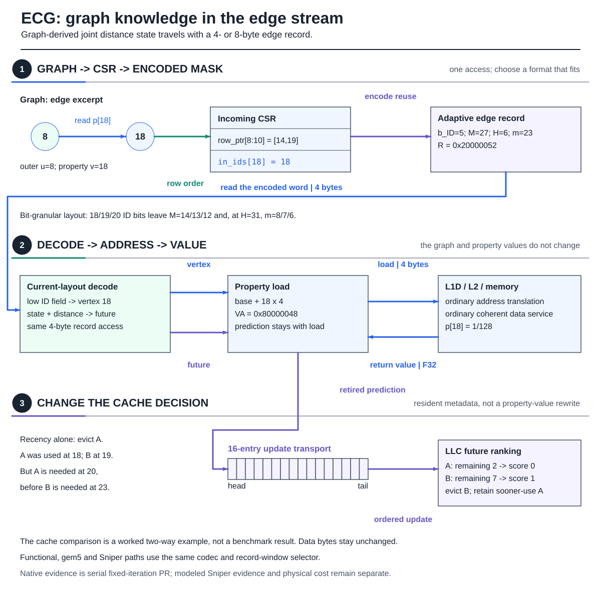

  

# ECG: edge-carried graph reuse

ECG derives cache-line reuse from a known graph traversal, stores a conservative
bound beside each encoded vertex ID, and carries that information with the real
record load. The same current codec drives functional cache decisions, native
gem5 execution, and modeled Sniper corroboration.

There is one graph-adaptive method, not public versioned or fixed-width format
families. The layout uses the maximum encoded
vertex ID, record count, requested 4/8-byte width, and minimum mantissa
precision. Four bytes are tried first; an explicit eight-byte record is used
when the ID and required metadata do not fit.

### Figure 1 — ECG: graph knowledge in the edge stream

**Figure 1.** Outer vertex `u=8` reads property `v=18` from CSR position
`j=18`. The next use of the same property line occurs at `j=22`. With
`record_count=34`, the layout is 4 bytes, 5 ID bits, 27 metadata bits,
6 horizon bits, 3 exponent bits, and 23 mantissa bits. Distance four becomes
FINITE token `16777218`, producing mask `0x20000040` and record
`0x20000052`.

Masking with `0x1f` recovers vertex 18. The property load still reads address
`0x80000048` and returns F32 `1/128` (`0x3c000000`). The cache receives
prediction metadata through a separate bounded path; metadata never replaces
the algorithm's value.

The example is PageRank pull. The **outer vertex** visits in-neighbors
`N_in(u)`, while the **property vertex** contributes to destinations in
`N_out(v)`, so its property-request count is `d_out(v)`. Traversing
out-neighbors `N_out(u)` instead reads property `p[v]` once for each source in
`N_in(v)`, giving `d_in(v)`. A dynamic frontier is not interchangeable with a
fixed sweep.

## Reading order

1. [Adaptive records and cache control](ReusePlan-FlowThrough) derives the
   layout, joint token, victim decision, record window, and storage costs.
2. [Traversal-aware preprocessing](Traversal-Metadata-Taxonomy) analyzes
   phase/data-specific requirements and measured preprocessing effects beyond PR, without algorithm replay.
3. [One edge, end to end](Property-to-Cache-Walkthrough) verifies the exact
   word, address, F32 value, deadline, and ownership boundaries.
4. [Native processor pipeline](RISC-V-Instruction-Path) follows raw32/raw64
   record loads and the dependent property load through gem5 O3.
5. [Evaluation methodology](Evaluation-Methodology) defines the current
   workload, per-algorithm performance scope and measurement criteria.
6. [Reproduction](Reproduction) gives the current preparation, qualification
   and guarded execution workflow.

## Current implementation status

| Surface | Implemented | Scope |
|---|---|---|
| cache_sim | adaptive 4/8-byte records, replacement, prefetch, matched transport | all four mechanisms admitted at both widths and exact 24 MiB; no native timing |
| gem5 RV64 O3 | raw records, typed F32/U32/U64 loads, managed phases, retirement and LLC-only prefetch | PR timing path and bounded current-algorithm qualification |
| Sniper | actual 4/8-byte loads and modeled transport/replacement/prefetch | all four mechanisms admitted; corroboration only, not RISC-V timing |
| physical design | 67-bit per-line payload can be counted | complete area, energy and timing are not established |

The native encoding is experimental custom-1 opcode `0x2b`, not a ratified
RISC-V extension. The guest polls bounded pending work before ROI end and
before releasing its separately allocated carrier.

Sniper uses `sg_kernel` for fixed PageRank and `algorithms` for the six additional
kernels, with one core, complete work, mandatory process-tree RSS protection and modulo LLC
indexing. Its update link is bounded completion corroboration, not retirement.

PageRank is integrated across all three backends. SpMV/BFS/SSSP/CC/BC/TC now have
current shared kernels and adapters across all three, with bounded detailed
qualification distinct from final-workload timing. See the
[per-algorithm table](Evaluation-Methodology#per-algorithm-performance)
before attributing this implementation's results to another algorithm.

The [P-OPT rank-attribution study](P-OPT-Rank-Attribution) isolates future
information from existing region/RRIP mechanics before new masking work.
The subsequent [frontier-conditioned mask prototype](Frontier-Cohort-Mask)
tests one BFS-specific design with real records and paid causal context.
The [GRASP reference-consumer diagnostic](GRASP-Reference-Consumer) tests
whether a fixed GRASP-based action can exploit graph ranks before another
compact producer is designed. The
[consumer-architecture study](Consumer-Architecture) then tests whether the
order that consumer applies to its candidates explains the traffic it still
loses to P-OPT; it does not.
