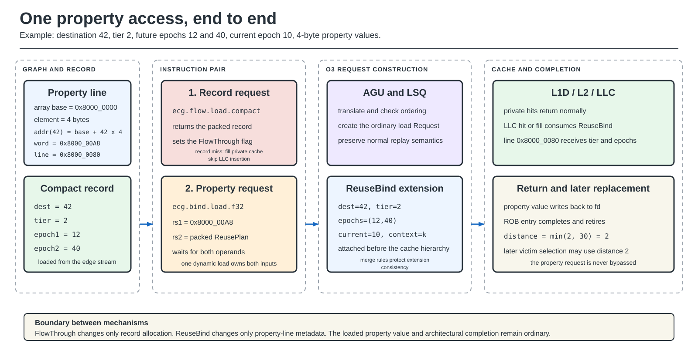
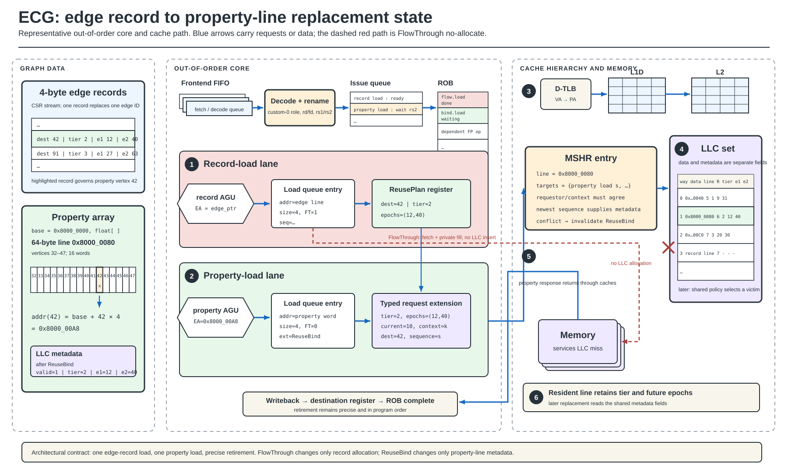

# Property Data to Cache: A Concrete Walkthrough

This page follows one property access from graph preprocessing through
instruction retirement and later LLC replacement. It also shows exactly where
each ECG mode changes the common path.

## Fixed example

Assume PageRank reads `outgoing_contrib[42]`:

| Item | Value |
|---|---|
| property-array base | `0x8000_0000` |
| property element size | 4 bytes |
| destination | 42 |
| property address | `0x8000_0000 + 42 x 4 = 0x8000_00A8` |
| 64-byte property line | `0x8000_0080`, containing vertices 32–47 |
| carried tier | 2, moderate |
| carried future epochs | 12 and 40 |
| current epoch | 10 |
| circular epoch count | 256 |

The nearest delivered reuse distance is

`min((12 + 256 - 10) mod 256, (40 + 256 - 10) mod 256) = 2`.

## Representative architecture

The compact walkthrough above emphasizes sequence. The detailed view below
shows the same access in representative processor structures: frontend FIFO,
issue queue, ROB, record and property load-queue entries, the ReusePlan
register dependency, typed request metadata, MSHR merge state, and an LLC set
with line-local replacement metadata.

The drawing is representative rather than a complete processor floorplan.
It shows the structures and state transitions implemented by ECG without
implying a particular commercial core width or cache-bank organization.

## Common lifecycle

The first eight steps are shared by the primary ReusePlan modes.

1. **Graph pass.** The builder groups properties by cache line, computes the
   line's reuse tier, and finds its next two reader epochs.
2. **Record construction.** The destination, tier, and epochs are packed into
   the edge record or its sidecar. For the example, the logical fields are
   `(42, 2, 12, 40)`.
3. **Record load.** `ecg.plan.load*` uses ordinary placement.
   `ecg.flow.load*` sets the FlowThrough request flag.
4. **Record response.** The packed record returns to an integer register. A
   FlowThrough LLC miss fills the private cache but does not allocate the
   returning record in the LLC.
5. **Property address.** The computed-address form receives
   `0x8000_00A8` in `rs1`. The indexed form calculates the same address from
   the property base and destination.
6. **ReuseBind execution.** `ecg.bind.load.*` or `ecg.bind.iload.*` waits for
   the address/base and packed record. The dynamic instruction owns both.
7. **Request construction.** The LSQ creates a normal memory request and
   attaches destination, tier, epochs, current epoch, context, and sequence as
   a typed ReuseBind extension.
8. **Cache lookup.** Translation and L1D/L2 lookup are normal. On an LLC hit or
   fill, the LLC consumes the extension and updates metadata for line
   `0x8000_0080`.
9. **Data return.** The 32-bit property value writes back to the integer or
   floating-point destination register.
10. **Retirement.** The ROB entry completes and retires in program order.
    Metadata remains with the LLC line until refresh, invalidation, or eviction.

FlowThrough belongs to step 3 and affects the record request only. ReuseBind
belongs to steps 6–8 and affects the property request only.

## Modes implemented in cache_sim, gem5, and Sniper

The backends share six mode names. The table states the metadata source and
the point where each mode changes the common path.

| Mode | Metadata source | Fill or hit action | Victim action |
|---|---|---|---|
| `DBG_ONLY` | degree/DBG tier | GRASP-style RRPV insertion and promotion | plain SRRIP |
| `DBG_PRIMARY` | DBG tier, then live P-OPT matrix | GRASP-style RRPV | max-RRPV, coldest tier, then farthest matrix distance |
| `POPT_PRIMARY` | live P-OPT matrix, then DBG tier | uniform P-OPT insertion; hit promotes | non-property first, then farthest matrix distance |
| `ECG_EMBEDDED` | stored compact P-OPT hint and DBG tier | store hint with line | max-RRPV, largest stored hint, then coldest tier |
| `ECG_COMBINED` | DBG tier and P-OPT hint | combine both into one insertion RRPV | plain SRRIP |
| `ECG_GRASP_POPT` | carried tier and two future epochs | GRASP-style insertion; stamp epochs | selected ReusePlan victim rule |

### `DBG_ONLY`

1. The property address is classified as hot, moderate, or cold.
2. The tier maps to RRPV 1, 6, or 7.
3. A hot-line hit promotes to RRPV 0; other hits decrement RRPV.
4. Victim selection is ordinary SRRIP. Tier does not break an eviction tie.

For the example, tier 2 inserts at RRPV 6. The epochs are irrelevant.

### `DBG_PRIMARY`

1. Fill and hit behavior is the same as `DBG_ONLY`.
2. SRRIP ages the set until at least one line reaches maximum RRPV.
3. Among maximum-RRPV lines, the coldest DBG tier is selected.
4. If several lines share that tier, live P-OPT distance breaks the tie.

The example line first competes as tier 2. Its two carried epochs are not the
matrix consulted by this mode.

### `POPT_PRIMARY`

1. Property lines receive the P-OPT insertion state.
2. Non-property lines are preferred for eviction.
3. The live rereference matrix supplies a distance for each property line.
4. The line with the farthest matrix distance is selected, with DBG used only
   as a secondary distinction where implemented.

This is a matrix-backed baseline. It does not use the two ReusePlan epochs.

### `ECG_EMBEDDED`

1. A compact P-OPT hint is captured when the line is filled.
2. SRRIP produces the maximum-RRPV candidate set.
3. The largest stored hint wins.
4. DBG tier resolves a remaining tie.

Unlike `POPT_PRIMARY`, eviction does not query the full matrix for every way.

### `ECG_COMBINED`

1. The DBG tier maps to a degree-based RRPV.
2. The P-OPT hint maps to a distance-based RRPV.
3. Their average becomes the insertion RRPV.
4. Hits promote the line.
5. Victim selection is plain SRRIP because both signals are already encoded in
   RRPV.

This mode changes admission, not the final victim ordering.

### `ECG_GRASP_POPT`

This is the ReusePlan transport mode.

1. The record supplies the line tier and two absolute future epochs.
2. ReuseBind stamps the property line on an LLC hit or fill.
3. The default `rrip_first` rule forms the maximum-RRPV set.
4. An old non-property line is preferred within that set.
5. If only governed property lines remain, the line with the farthest nearest
   future use is selected.

For the example, the line's effective distance is 2. Another eligible line
with distance 10 is evicted first.

`ECG_GRASP_POPT` also supports controlled victim variants:

| Variant | Selection rule |
|---|---|
| `grasp_only` | pure RRIP; epochs ignored |
| `rrip_first` | RRIP eligibility, record preference, then farthest epoch |
| `epoch_first` | oldest record first; otherwise farthest stamped property |
| `degree_first` | RRIP eligibility, record preference, coldest tier, then epoch |
| `shortcircuit` | first non-property line; otherwise farthest epoch |
| `lru_only` | oldest line |

The online selector assigns leader sets to `rrip_first`, `grasp_only`,
`epoch_first`, `degree_first`, and `lru_only`; follower sets use the current
winner. Epoch-informed admission is a separate diagnostic that maps the first
future epoch directly to insertion and hit RRPV while retaining
`rrip_first` eviction.

## cache_sim-only diagnostic modes

These modes are not architectural gem5/Sniper modes and must not be described
as cross-backend results.

| Mode | Purpose | End point |
|---|---|---|
| `POPT_TIE` | isolate matrix use after SRRIP has narrowed candidates | matrix chooses among maximum-RRPV lines |
| `ECG_EPOCH_EMBEDDED` | recompute a compact current-epoch P-OPT hint | hint then DBG chooses the victim |
| `ECG_EXACT` | live, quantization-free next-reference ceiling | exact farthest future line is evicted |
| `ECG_EXACT_STORED` | isolate staleness of an access-time exact stamp | stored exact prediction selects the victim |
| `ECG_EXACT_MASK` | model a precomputed 5-bit per-edge exact hint | hint drives RRPV and tie-breaking |

## What reaches architectural state

| State | Lifetime |
|---|---|
| record-format CSR | configured before the ROI |
| current-epoch CSR | updated at epoch boundaries |
| context CSR | active execution context |
| ReuseBind request extension | one dynamic property request and compatible MSHR merges |
| line tier and epochs | until refresh, invalidation, or eviction |
| loaded property value | normal destination-register and ROB lifetime |

The mechanism never changes the property value. It changes only the metadata
used to retain or evict the line that contains that value.

## Source map

| Layer | Source |
|---|---|
| record construction | `bench/include/ecg_reuse_plan_builder.h` |
| shared victim and admission rules | `bench/include/ecg_victim_policy.h` |
| cache_sim adapter | `bench/include/cache_sim/cache_sim.h` |
| gem5 ISA and request path | `bench/include/gem5_sim/overlays/arch/riscv/` |
| gem5 replacement adapter | `bench/include/gem5_sim/overlays/mem/cache/replacement_policies/ecg_rp.cc` |
| Sniper replacement adapter | `bench/include/sniper_sim/overlays/common/core/memory_subsystem/cache/cache_set_ecg.cc` |
