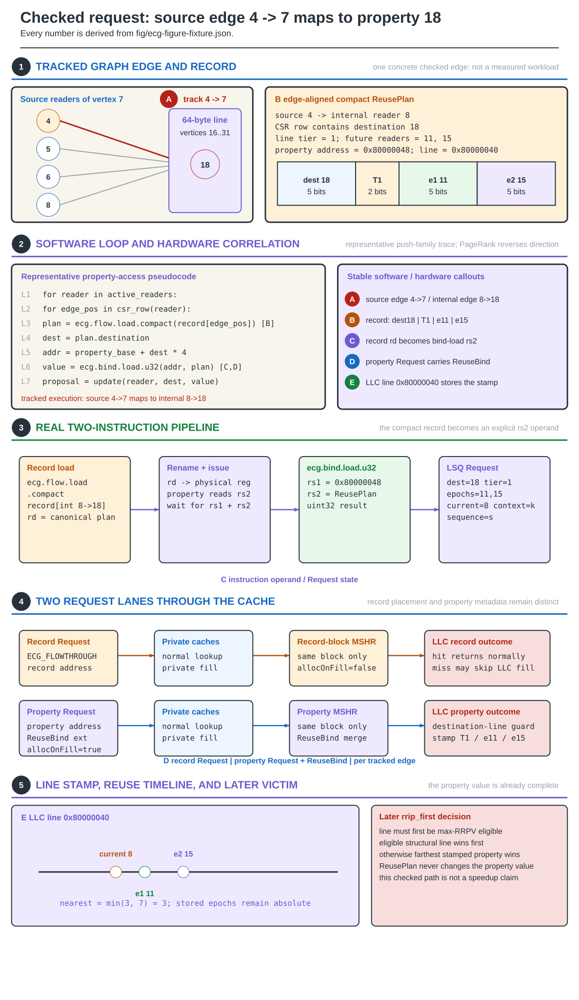
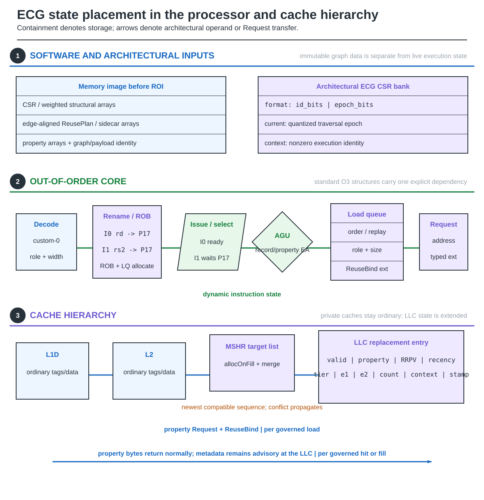

# A checked Scale6 edge-to-cache example

This example uses the topology in `fig/ecg-figure-fixture.json`. Its sparse
internal IDs make cache-line sharing visible. The fixture is undirected, so
incoming and outgoing rows agree; PageRank pull traverses the in-neighbors.
Weights in the source fixture are irrelevant to this property-access example.

## 1. Record, address, and future bound

### Figure 1 — One edge word, one property line, one update

**Figure 1.** Fixture adjacency `4 -> 7` maps to internal outer vertex `8`
and property vertex `18`. The in-neighbor row is `[3, 6, 7, 11, 18]`, stored
at edge positions `[14, 19)`. Position `18` is sequence `19` in the model's
one-based governed-request coordinate.

| Quantity | Derived value |
|---|---|
| property vertex | `18` |
| current edge position / sequence | `18` / `19` |
| next access to the same property line | position `22`, sequence `23` |
| true request distance | `22 - 18 = 4` |
| finite token | `2 + floor(log2(4)) = 4` |
| decoded upper-bound distance | `2^(2 + 1) - 1 = 7` |
| packed word with forced 26-bit IDs | `(4 << 26) | 18 = 0x10000012` |
| property address | `0x80000000 + 18 * 4 = 0x80000048` |
| property cache line | `0x80000040`, vertices `16..31` |
| candidate deadline | `19 + 7 = 26` |

Vertex `20` shares this property line. The next-line-use calculation
therefore scans all requests to vertices `16..31`, not just vertex `18`.
The generator derives these values from the fixture rather than maintaining
a separately typed diagram example.

## 2. Do not turn quantization into false certainty

A demand LLC hit/fill can stamp the request-bound prediction. Holding this
prediction fixed, its effective state becomes UNKNOWN at sequence `27`;
that does not prove the line is dead. Subsequent hits and commit refreshes
can replace the prediction with a newer one.

The modeled commit channel has an eight-request delay. That is longer than
this example's seven-request decoded bound, so a delayed copy of this exact
prediction may already be expired. It must be discarded, not drawn as a
freshly installed deadline at arrival. A newer coalesced update has its own
sequence and deadline.

This is functional-model arithmetic, not a native cache-policy or retirement
result. The new Scale6 operand pair alone does not implement that complete route.

## 3. Storage ownership and lifetime

### Figure 2 — Where Scale6 metadata lives

**Figure 2.** Persistent graph records, temporary construction arrays, and
runtime metadata have different lifetimes and cost domains. At an 8 MiB,
64-byte-line LLC there are 131,072 lines. The accounted 35 added bits per line
contribute 4,587,520 bits; the queues, lookahead and control add 3,064 bits,
for 4,590,584 bits total, about 560 KiB.

The edge token has no added sidecar cost because it replaces unused space in
the same four-byte destination record. The LLC/controller state is still an
additional on-chip cost. Keeping all data ways is not automatically keeping
the same silicon area.

Compare P-OPT's active payload, rounded reserved-way capacity, complete DRAM
matrix and transfer traffic separately. A footprint ratio against the
complete matrix is not an area measurement.

## 4. Supported evidence

cache_sim implements this record and cache policy. Native Scale6 request
binding, retirement delivery, cycle-timed prefetching and physical-cost
qualification remain distinct work. The existing RISC-V ReuseBind path and
older RTL components cannot stand in for that missing implementation.

See [RISC-V integration](RISC-V-Instruction-Path),
[Scale6 cache control](ReusePlan-FlowThrough), and
[Evaluation methodology](Evaluation-Methodology).
