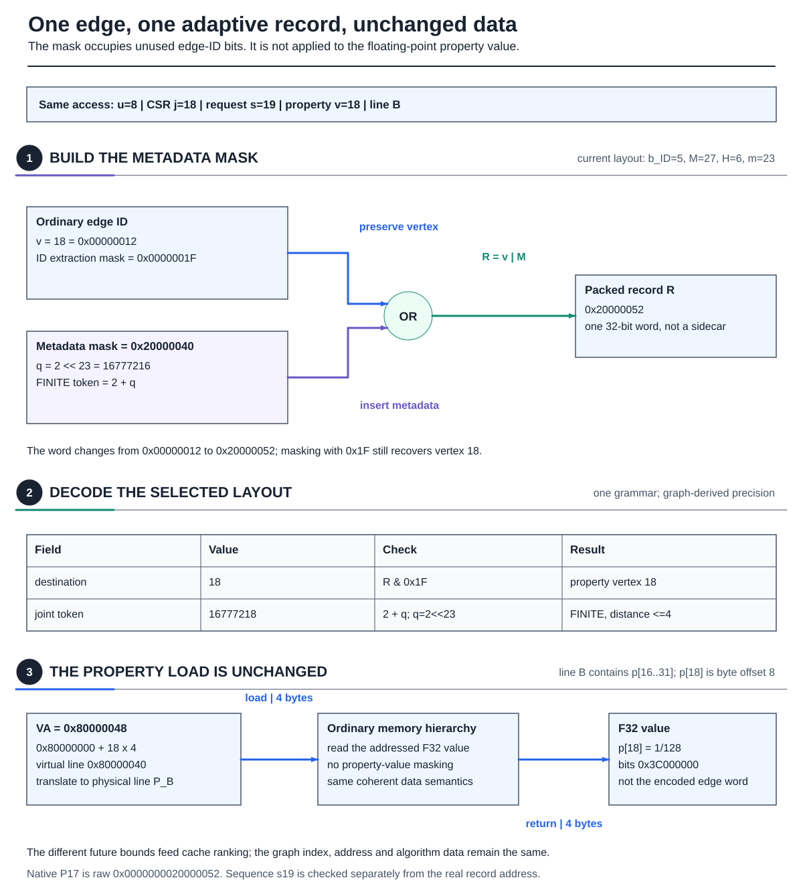
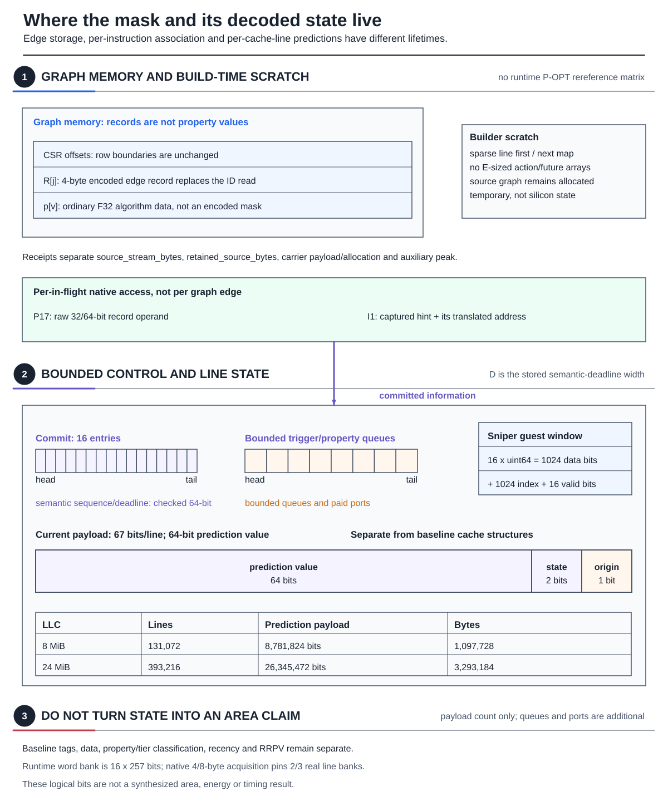

# One edge from graph structure to a cache decision

This page follows one checked access from the shared fixture. The graph has
32 vertices and 34 directed adjacency records after expanding its undirected
edges. Nine vertices are non-isolated in the drawing.

## 1. Locate the governed property access

PageRank pull visits the in-neighbors of outer vertex `u=8`:

```text
row_ptr[8] = 14
row_ptr[9] = 19
in_ids[14:19] = [3, 6, 7, 11, 18]
```

Record `j=18` names property vertex `v=18`. Its semantic request is `s=19`.
With four-byte properties and 64-byte lines, `p[18]` lies on line B
(`p[16..31]`). The next B access is `j=22`, so the true line-reuse distance is
four. Position is not identity: `j=22` also happens to contain ID 18.

## 2. Pack the current adaptive record

### Figure 1 — One edge, one adaptive record, unchanged data



**Figure 1.** The current 32-bit fixture record uses every metadata bit while
preserving the ordinary property address and value.

The maximum encoded fixture ID needs five bits. With a 32-bit word:

```text
id_bits=5
metadata_bits=27
horizon_bits=bit_width(34)=6
exponent_bits=bit_width(6-1)=3
mantissa_bits=23
```

For distance four, exponent is two and mantissa is zero:

```text
q              = 2 << 23 = 16777216
FINITE token   = 2 + q   = 16777218
metadata mask  = token << 5 = 0x20000040
record         = mask | 18  = 0x20000052
decoded vertex = record & 0x1f = 18
deadline       = s19 + 4 = 23
```

No small-graph bits are left unused and there is no action field. The state
and distance occupy one joint token space: UNKNOWN 0, DEAD 1, FINITE `2+q`,
and WRAP `2+K+q`, where `K=H*2^m`.

## 3. Recover the ordinary property value

With illustrative property base `0x80000000`:

```text
property VA = 0x80000000 + 18 * 4 = 0x80000048
virtual line = 0x80000040
offset within the line = 8
```

Translation determines the physical line; VA is not assumed equal to PA.
At this point in the first iteration, vertex 18 has not yet been updated.
Its out-degree is four and scores start at `1/32`, so the returned contribution
is `1/128`, F32 bits `0x3c000000`. Record metadata is never applied to those
floating-point bits.

## 4. Keep record, address, and sequence distinct

The native record operation performs a real 4-byte load and returns raw
`0x0000000020000052` in illustrative integer rename tag P17. The dependent
PropertyF32 instruction consumes three explicit sources:

1. property base;
2. the raw record word; and
3. the real record address.

For optional record base `0x60000000`, `j=18` has record address
`0x60000048`. The implementation derives semantic sequence 19 from that
address, the configured count, and iteration base. Sequence is not packed into
the GPR. The property result goes separately to illustrative F9.

The property instruction retains its own decoded prediction, context,
generation, sequence, and translated physical address. An LLC demand access
or fill can create a PENDING observation; only successful retirement can
enqueue a prediction.

## 5. Explain the victim choice

The preceding record `j=17` reads `p[11]` on line A. Its next A access is
`j=19`, so distance two and deadline 20 are exact. At watermark 19:

| Resident line | Last touch | Actual next use | Remaining bound | Score |
|---|---:|---:|---:|---:|
| A, vertices `0..15` | 18 | 20 | 1 | 0 |
| B, vertices `16..31` | 19 | 23 | 4 | 1 |

For an incoming scores-line C, LRU selects older A. ECG selects B, retaining A
for the immediately upcoming request. This two-way snapshot is explanatory,
not a measured workload result.

Prediction delivery does not mutate ordinary RRPV or recency. It updates only
the dedicated prediction metadata. If a FINITE bound passes without refresh,
its effective state becomes UNKNOWN rather than DEAD.

## 6. Account for each storage owner

### Figure 2 — Where the mask and its decoded state live



**Figure 2.** Graph storage, transient processor state, transport queues, and
resident cache prediction state have different owners and lifetimes.

| State | Owner and lifetime |
|---|---|
| source graph stream | retained graph input |
| encoded carrier | separate `vector<uint32_t>` or `vector<uint64_t>` constructed before ROI |
| builder scratch | sparse property-line first/next map; no edge-sized action/future arrays |
| raw operand and hint | register and in-flight `DynInst` lifetime |
| update/prefetch entries | bounded queues with explicit latency and ports |
| record window | two real line banks for 4-byte records, up to three for unaligned 8-byte records |
| resident prediction | 64-bit value + 2-bit state + 1-bit origin per LLC line |

Receipts separately report source stream, retained source, carrier payload,
carrier allocation, and auxiliary peak bytes. The current path does not claim
in-place construction or source restoration.

Sniper's guest window is 16 `uint64_t` software words for both record widths:
1,024 data bits, 1,024 index bits, and 16 validity bits. Its runtime word bank
is separately accounted as `16 * 257` bits. Native acquisition instead pins
two real 64-byte record-line banks for 4-byte records or up to three for an
unaligned 8-byte window.

At 8 MiB, 131,072 lines require 8,781,824 prediction bits
(1,097,728 bytes). At 24 MiB, 393,216 lines require 26,345,472 bits
(3,293,184 bytes). Baseline cache structures, queues, validation and ports are
additional. These values are not synthesized area.
