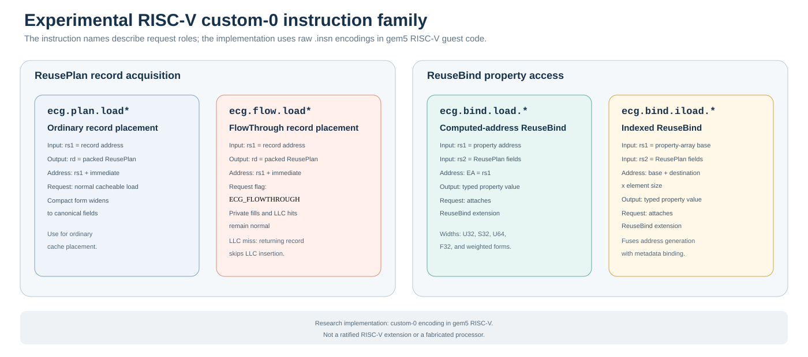
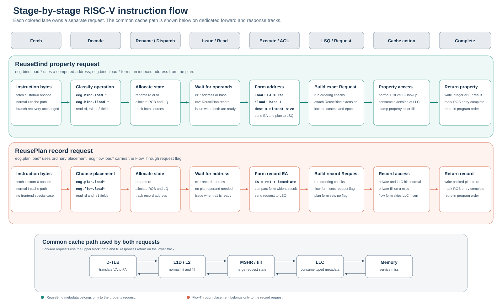

# RISC-V Instruction Path

ECG Next implements an experimental custom-0 RISC-V instruction family in
gem5. Matching RISC-V graph kernels issue the encodings with `.insn`, so the
measured guest executes the same operations decoded by the simulator.

This is a research ISA extension. It is not a ratified RISC-V extension, an
upstream gem5 ISA feature, or a claim of fabricated processor support.

## Instruction family

The family separates record acquisition from property access:

| Instruction | Inputs | Result | Request effect |
|---|---|---|---|
| `ecg.plan.load*` | record address | packed ReusePlan in `rd` | ordinary cacheable record load |
| `ecg.flow.load*` | record address | packed ReusePlan in `rd` | sets the FlowThrough request flag |
| `ecg.bind.load.*` | property address in `rs1`, ReusePlan in `rs2` | typed property value | attaches a ReuseBind extension |
| `ecg.bind.iload.*` | property base in `rs1`, ReusePlan in `rs2` | typed property value | forms the indexed address and attaches ReuseBind |

The `*` forms cover compact records, weighted records, integer property widths,
and the bit-preserving floating-point PageRank load. They share the same
semantic fields: destination, reuse tier, two future epochs, current epoch, and
execution context.

## Stage-by-stage flow

The figure uses one lane per request. Arrows remain inside their lane until the
common cache path, avoiding the ambiguity of drawing metadata, data, and
control on the same connector.

### 1. Fetch

The custom-0 instruction follows the normal frontend path. Fetch, prediction,
I-cache access, branch recovery, and instruction buffering are unchanged.

### 2. Decode

Decode identifies one of four roles:

- ordinary ReusePlan record acquisition;
- FlowThrough record acquisition;
- computed-address ReuseBind property load; or
- indexed ReuseBind property load.

The opcode determines the memory width and destination register class. Compact
record formats use the ECG record-format CSR configured before the region of
interest.

### 3. Rename and dispatch

The destination register is renamed normally. The instruction allocates its
reorder-buffer and load-queue state:

- record loads track the record address source;
- computed ReuseBind loads track the property address and ReusePlan sources;
- indexed ReuseBind loads track the property-array base and ReusePlan sources.

No shared metadata mailbox is required for the O3 path.

### 4. Issue and register read

A record load issues when its address source is ready. A ReuseBind property
load waits for both the address/base operand and the ReusePlan operand. This
dependency keeps the plan paired with the dynamic property-load instruction
through out-of-order scheduling.

### 5. Execute and address generation

The address-generation unit computes:

- `ecg.plan.load*` and `ecg.flow.load*`: record address plus immediate;
- `ecg.bind.load.*`: the already-computed property address in `rs1`; and
- `ecg.bind.iload.*`: property base plus destination times element size.

The instruction encoding and effective-address calculation are fixed before
the request enters the load/store queue.

### 6. Load/store queue and Request construction

The load/store queue performs normal ordering and replay checks. It then builds
the memory Request:

- ReuseBind loads attach destination, tier, both epochs, current epoch,
  context, and sequence state as a typed request extension.
- FlowThrough loads set the `ECG_FLOWTHROUGH` request flag.
- Ordinary ReusePlan loads attach neither placement nor property metadata.

MSHR merges preserve the ReuseBind extension only when merged requests agree;
conflicting metadata is explicitly marked invalid.

### 7. Cache hierarchy

All requests use normal address translation and private-cache lookup.

For a ReuseBind property request:

- L1/L2 and LLC hits return the property normally;
- the typed extension follows a miss;
- the LLC consumes the extension on a property hit or fill; and
- the line stores the ReusePlan tier and epochs for replacement.

For a FlowThrough record request:

- private-cache hits and fills remain normal;
- an LLC hit remains normal; and
- only an LLC miss suppresses insertion of the returning record into the LLC.

The property request is never bypassed.

### 8. Completion and retirement

Loaded data returns through the normal response path. Integer and
floating-point destinations write back normally, the reorder-buffer entry is
marked complete, and the instruction retires in program order.

## Canonical computed-address sequence

The primary computed-address path uses two instructions:

1. `ecg.flow.load` acquires the ReusePlan record and gives that record request
   FlowThrough placement.
2. Software computes the property address from the record destination.
3. `ecg.bind.load.*` loads the property and binds the plan to that exact
   property request.

The indexed alternative replaces steps 2 and 3 with `ecg.bind.iload.*`.

## Implementation map

| Path | Purpose |
|---|---|
| `bench/include/gem5_sim/overlays/arch/riscv/isa/decoder_ecg_extract.isa` | gem5 custom-0 decoding and request semantics |
| `bench/include/gem5_sim/overlays/arch/riscv/isa/formats/ecg.isa` | decoder bit fields |
| `bench/include/gem5_sim/gem5_harness.h` | guest-side `.insn` emitters |
| `bench/include/gem5_sim/overlays/mem/cache/replacement_policies/ecg_reuse_bind_request_ext.hh` | typed ReuseBind request extension and MSHR merge state |
| `bench/include/gem5_sim/overlays/cpu/o3/lsq_ecg_producer.patch` | exact dynamic-instruction to Request attachment |
| `bench/src_gem5/` | RISC-V graph-kernel call sites |

The [ReusePlan and FlowThrough design guide](ReusePlan-FlowThrough) explains
the record format and replacement policy. The
[evaluation methodology](Evaluation-Methodology) defines how the RISC-V gem5
path is used for architectural timing.
