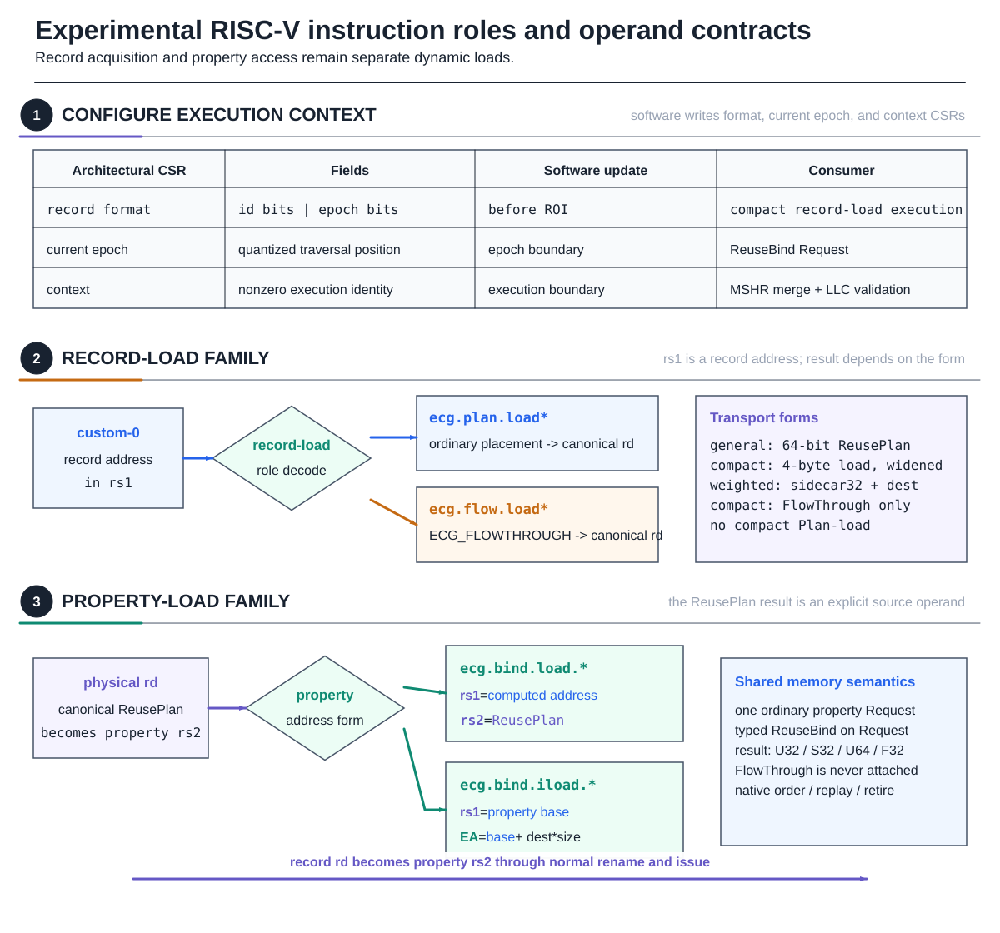
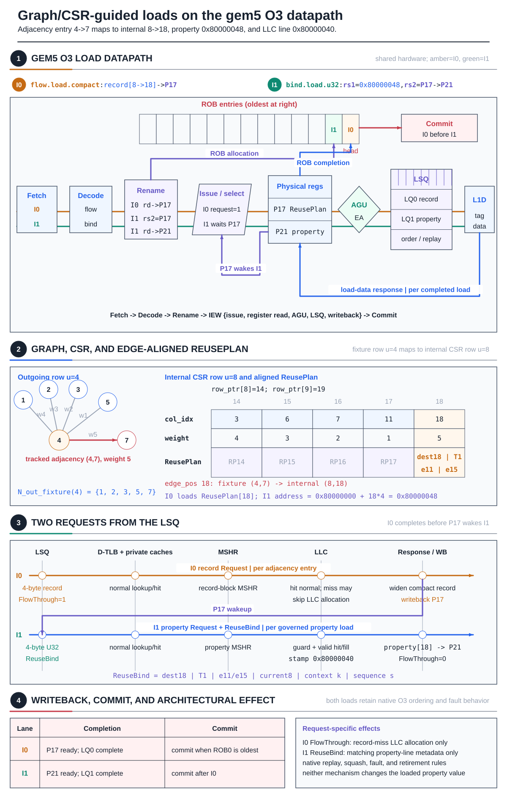
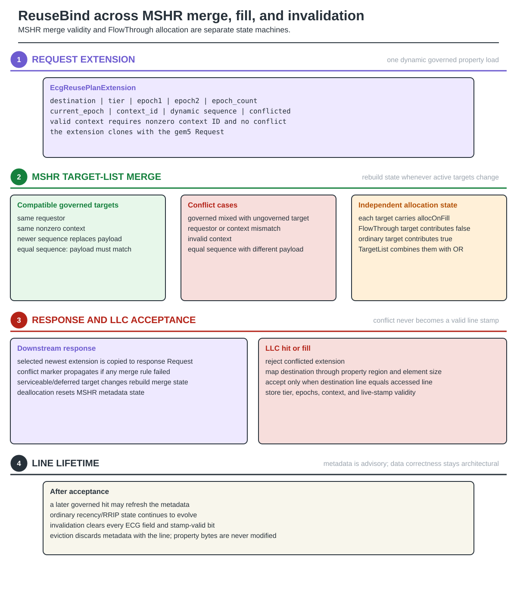

# RISC-V integration: existing support and Scale6 target

The repository contains an experimental custom-0 RISC-V ReusePlan/ReuseBind
implementation in gem5. **It is not the native Scale6 implementation.**
Scale6 currently executes in cache_sim; its request format, retirement update
channel and native prefetch delivery still need implementation and timing
evidence.

## 1. Reuse the execution discipline, not the old bit layout

### Figure 1 — RISC-V integration: existing path and next step

**Figure 1.** Existing record acquisition and property access remain two
dynamic operations with an explicit renamed dependency. That foundation does
not automatically implement the Scale6 token or its commit/prefetch channels.
The lower panel is a target contract, not a list of completed opcodes.

| Existing family | Role in the legacy implementation |
|---|---|
| `ecg.plan.load` | ordinary-placement general ReusePlan acquisition |
| `ecg.flow.load` / `.compact` | record acquisition with request-specific FlowThrough |
| weighted record helpers | acquire the existing weighted sidecar formats |
| `ecg.bind.load.*` | computed-address typed property load with ReuseBind |
| `ecg.bind.iload.*` | indexed property load with ReuseBind |

The old current-epoch/context/format CSRs and tier/two-epoch payload belong to
that implementation. Scale6 uses a request-sequence future bound, not two
outer-vertex epochs. Its final ISA representation is not asserted here.
The research instruction family is neither a ratified RISC-V extension nor
an upstream gem5 feature.

## 2. The native Scale6 target

### Figure 2 — Target Scale6 path through an out-of-order core

**Figure 2.** The checked word `0x10000012` names property vertex `18` and
token `4`. Standard O3 mechanisms must preserve the association with its own
property access. A private hit returns data without reaching the LLC, but
the eventual committed access may still need to refresh resident LLC metadata.

The native design must retain the dynamic token, traversal position, context
and translated line identity through ordinary memory dependence, replay,
exception and squash handling. It must not reconstruct the association
through a shared last-request mailbox or an uncharged per-vertex oracle.

Data completion and architectural retirement are different events. Ordinary
data requests can be speculative; a retirement-only commit refresh must not
be enqueued by a squashed load. The current O3 producer attaches legacy
ReuseBind metadata at LSQ Request construction and does not provide this
Scale6 retirement channel.

## 3. MSHR lifetime versus metadata lifetime

### Figure 3 — Request lifetime is not metadata lifetime

**Figure 3.** Existing MSHR merge rules select compatible per-request
metadata. Commit-update coalescing instead carries later committed knowledge
about a resident line. These are not interchangeable mechanisms.

Existing ReuseBind compatibility requires matching requestor and nonzero
context. The newest sequence supplies the payload; equal sequences require
identical payloads. Mixed ordinary/ReuseBind targets, incompatible contexts or
payload conflicts propagate a conflict marker. The MSHR clears this state
on release.

`allocOnFill` is independent and combines with OR. The primary Scale6
comparison does not enable FlowThrough. Future native refresh must also
handle a line being evicted before an update arrives and must discard expired
updates without inventing a new data allocation.

## 4. What remains before timing claims

The model's 16-entry commit queue, eight-request latency and eight-entry
prefetch queue are not cycle-accurate gem5 structures. The native path must
model latency, bandwidth, translation, queue pressure, ordering and drain.
Lookahead must consume real carrier data rather than a free host-side future
table. REF32 gem5 and Sniper rows therefore remain unsupported at the runner.

## Implementation sources

| Existing surface | Source |
|---|---|
| custom instruction roles | `bench/include/gem5_sim/overlays/arch/riscv/isa/decoder_ecg_extract.isa` |
| decoder fields | `bench/include/gem5_sim/overlays/arch/riscv/isa/formats/ecg.isa` |
| guest emitters | `bench/include/gem5_sim/gem5_harness.h` |
| dynamic producer state | `bench/include/gem5_sim/overlays/cpu/o3/dyn_inst_ecg_producer.patch` |
| LSQ attachment | `bench/include/gem5_sim/overlays/cpu/o3/lsq_ecg_producer.patch` |
| Request extension and merge rules | `bench/include/gem5_sim/overlays/mem/cache/replacement_policies/ecg_reuse_bind_request_ext.hh` |
| MSHR integration | `bench/include/gem5_sim/overlays/mem/cache/mshr_ecg_merge.patch` |
| supported-backend gates | `scripts/experiments/ecg/roi_matrix.py` |
