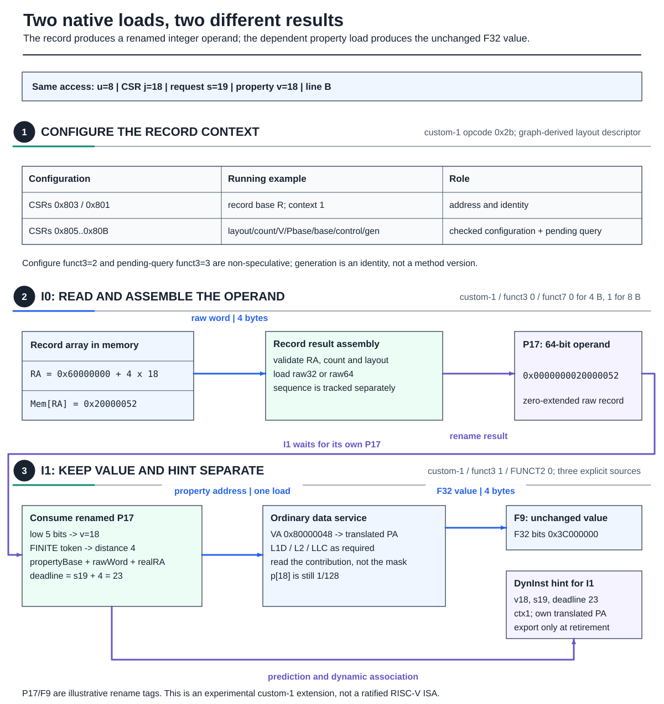
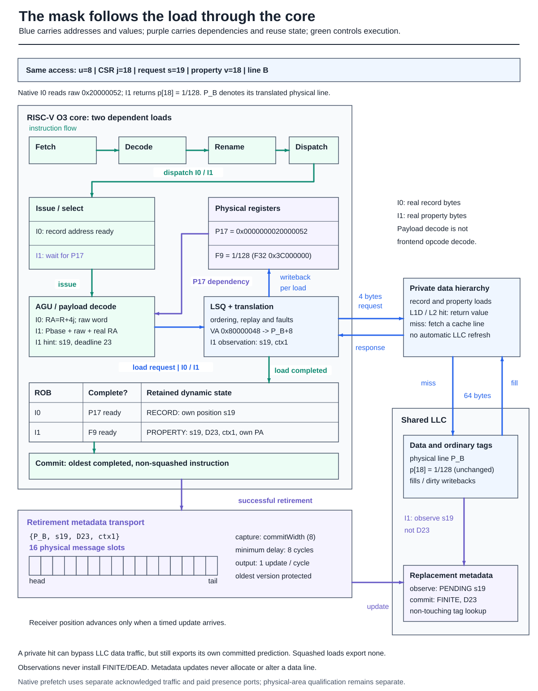
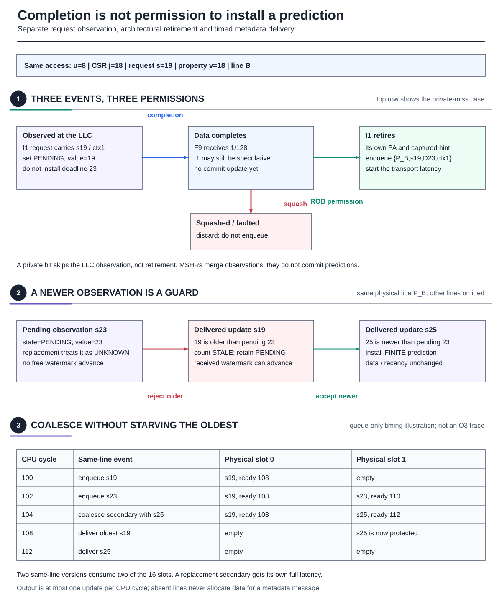

# Native record-to-cache pipeline

The current native path implements the same graph-adaptive 4/8-byte record
layout as the functional model. It performs real record and property loads in
RV64 gem5 O3, preserves their dependency through renamed state, transports
predictions at retirement, and supports replacement and acknowledged LLC-only
prefetching. PageRank retains its dense exact contract; SpMV, BFS, SSSP, CC,
BC and TC additionally have bounded current-path qualification.

## 1. Two loads, two distinct results

### Figure 1 — Two native loads, two different results

**Figure 1.** The record load returns only the raw record. The dependent
property load combines it with the real record address and configured bases.

The experimental instructions use custom-1 opcode `0x2b` because the
custom-0 funct3 space is occupied by older controls:

| Operation | Encoding | Memory/result |
|---|---|---|
| Record32 | funct3 `0`, funct7 `0` | real 4-byte load; zero-extended raw word |
| Record64 | funct3 `0`, funct7 `1` | real 8-byte load; raw word |
| PropertyF32 R4 | funct3 `1`, FUNCT2 `0` | sources are property base, raw record word, and real record address; result is normal F32 data |
| PropertyU32 R4 | funct3 `1`, FUNCT2 `1` | same three integer sources; real 4-byte load returned as zero-extended integer bits |
| PropertyU64 R4 | funct3 `1`, FUNCT2 `2` | same sources; real 8-byte integer result, without float reinterpretation |
| Configure | funct3 `2` | non-speculative configuration operation |
| Pending query | funct3 `3` | non-speculative bounded completion query |
| Pass close | funct3 `4` | serialized controller-derived structural boundary |
| Invalidate binding | funct3 `5` | serialized, drained metadata set walk before rebind |

The GPR contains the raw record, not a packed `sequence32|word32`. For the
fixture, optional record base `0x60000000` gives record address `0x60000048`;
P17 contains `0x0000000020000052`. Sequence 19 is derived and checked
separately from the real record address, record count, and iteration base.
Property address is `0x80000048`; F9 receives F32 `1/128`
(`0x3c000000`).

Configuration uses CSR `0x803` for record base and `0x801` for context, plus:

| CSR | Field |
|---|---|
| `0x805` | packed layout descriptor |
| `0x806` | record count |
| `0x807` | vertex count |
| `0x808` | property base |
| `0x809` | iteration base |
| `0x80A` | enable / has-next / managed-pass control |
| `0x80B` | generation identity |
| `0x80C` | property kind, byte stride and traversal-mode descriptor; zero preserves the original F32 PR ABI |

Generation is a correctness identity, not a method-version API. Invalid width,
layout, address, horizon, generation, sequence, or deadline arithmetic fails
closed.

### Graph-derived VID width reaches the instructions

The PageRank guest inspects the actual incoming source IDs before selecting the
layout. Both record opcodes and PropertyF32 decode through the descriptor in
CSR `0x805`; the ISA does not reserve a fixed number of VID or metadata bits.
The low `id_bits` identify the property, and all remaining record bits belong
to the joint state/distance grammar. A 19-bit VID therefore retains 13 metadata
bits in a four-byte record. The record-count horizon then determines how much
of that budget is available as mantissa precision.

`record_isa_smoke` exercises actual RV64 O3 loads at VID widths 1, 5, 18, 19,
20, 26, 29, 30, 31, and 32 with automatic carrier selection, plus a forced-wide
19-bit case. It reads IDs at the top of each domain, checks the raw word and
exact F32 bits, and backs only the final few logical properties with 16 bytes.
This sparse-address instruction probe avoids allocating a multi-gigabyte
property array. In its four-record stream, 29-bit IDs still fit four bytes;
30-32-bit IDs select eight. That transition is specific to its short horizon,
not a fixed graph-size threshold.

The high unsigned-32 VID probe succeeds through Record64 and PropertyF32.
This establishes instruction/address support, **not** full unsigned-32 graph
loading: the current PageRank loaders still use signed-32 `NodeID` and reject
out-of-domain graphs.

The probe also accepts a logical record count and an optional iteration base.
Large-count cases execute only a four-record instruction prefix, not the
declared full traversal. They cover the low-precision 26-VID/6-metadata/H31
layout, count-driven widening at H32, and a `2^32` record-count descriptor
with H33. Real operand loads and property addressing remain backed by a few
words; the tests do not allocate the logical graph. These are ISA-boundary
checks with LRU, not large-graph replacement/prefetch evaluations.
An initial nonzero sequence jump is rejected by retirement continuity rather
than enabled as a testing shortcut. Wider sequence/deadline arithmetic and
queue preservation are additionally covered by the shared C++ contract tests.

## 2. Preserve the real dependency

### Figure 2 — The mask follows the load through the core

**Figure 2.** Blue paths carry addresses/data, purple paths carry dependency
and prediction state, and retirement authorizes the separate update channel.

Decode sees an instruction, not future record contents. Rename assigns I0's
integer result a physical destination, and I1 waits for that exact raw word.
Both operations use the AGU, LSQ, translation and ordinary cache hierarchy.
I1 additionally consumes the real record address so it can derive and validate
the semantic position without a shared mailbox or host future table.

I1's decoded prediction stays on its own `DynInst`. Its property result remains
ordinary F32 or integer data. At retirement, the instruction exports its own
translated physical line, semantic sequence, deadline, state, context, and
generation. A squashed or faulted instruction exports nothing.

In dense exact mode, LLC demand observation and retirement have different authority:

1. A private miss may mark the resident line PENDING with its newest observed
   sequence. It never installs FINITE/DEAD and never advances the watermark.
2. Successful retirement enqueues a delayed update. This also covers private
   hits that produced no LLC demand.
3. Delivery performs a non-touching resident lookup. It advances the received
   watermark even for absent or stale outcomes, but never allocates, dirties,
   or changes ordinary recency/RRPV.

## 3. Bound speculative and committed lifetimes

### Figure 3 — Completion is not permission to install a prediction

**Figure 3.** A demand access or fill may create a PENDING observation.
Completion alone does not authorize a prediction; successful retirement does.

MSHR/request state carries observations only. Older commits cannot overwrite a
newer pending observation. Two same-line versions may occupy separate physical
queue slots; the oldest is protected, while further updates may replace only
the secondary and receive their own full delay.

The retirement queue has 16 physical slots, minimum eight CPU-cycle latency,
configurable capture width from 1 through 16 (default CPU commit width), and
one output per cycle. Same-ready entries preserve capture-lane order.
Semantic sequence and deadline are checked 64-bit values; coalescing may span
multiple traversals.

### Managed algorithm passes

SpMV and TC use managed dense passes; BFS, SSSP, CC and BC use ordered-filtered
passes with **next-potential designated-read** semantics. Structural positions
increase within a pass. Close accounts for skipped positions and advances only
to the controller-computed end. It cannot seed an arbitrary future sequence.

Filtered WRAP/DEAD become UNKNOWN. FINITE bounds are capped at the pass end and
expire at closure, including coarse quantized bounds. Filtered structural progress
is separate from delivered update order. Ordinary governed accesses use ordered
invalidations; unrelated memory operations may intervene between the two custom
loads without breaking their exact record/address association.

Rebind requires closed work, no pending pair, drained queues, a consecutive
generation, and one LLC metadata set per cycle. It does not evict data or perform
a free global reset. BC uses U32 depth then F32 dependency, retaining checked U64
path counts. TC's governed U64 row-start array is distinct from its ordinary
adjacency-list traffic. The figures retain the dense PageRank example unchanged.

Boundary workloads cover distance `6442450941`, a 70-vertex Brandes graph with
`2^34` paths at its sink and score sum `1156`, zero-governed-work sources, and
explicit rejection of U64 path-count overflow across all three backends.

## 4. Native record-window prefetch

Native prefetch uses the same 16-record rule as the functional path. Real
record bytes become available through L1D fills or acknowledged timing reads:
two 64-byte banks cover a 4-byte window and up to three cover an unaligned
8-byte window. Missing bytes yield `NOT_READY`.

The implementation models:

- actual MMU translation;
- bounded trigger and property queues, default 16;
- one lookup-pipeline input per cycle;
- dedicated L1/L2/LLC presence ports;
- default 12-cycle lookup and 8-cycle prefetch pipeline;
- retry-capable request ports and charged in-ROI drain;
- issue and completion duplicate/admission checks; and
- safe request-scoped known-DEAD miss bypass with MSHR allocation requirements
  merged by logical OR.

Property traffic enters at the LLC input as `Request::PREFETCH` with an
acknowledged `ReadReq`. It does not use cache-owned `HardPFReq`, which may be
squashed without an upstream response. The guest polls pending work within a
finite bound before ROI end and before freeing the carrier.

## 5. State and evidence boundaries

The current per-line prediction payload is 67 logical bits:
64-bit value, two state bits, and one origin bit. It is additional to baseline
tags, data, property/tier classification, recency/RRPV, queues, validation, and
port logic. At 8 MiB it is 8,781,824 bits (1,097,728 bytes); at 24 MiB it is
26,345,472 bits (3,293,184 bytes). These are payload counts, not complete
silicon-area results.

For a 64-byte data line, `67 / 512 = 13.1%`: even the prediction payload is
not zero-cost. This ratio is relative to data bits, not total cache or CPU
area. Physical "low overhead" remains an open measurement claim.

| Current requirement | Hardware evidence still needed |
|---|---|
| 67-bit resident prediction plus binding/classification state | Map `RecordReplData` and VA/PA identity checks to baseline tags versus genuinely additional state; do not treat a C++ object size as an SRAM implementation. |
| Typed property loads' three integer source operands | Establish RF/forwarding/AGU integration and its port, latency, and energy cost. |
| Dedicated update tag access and three prefetch presence-check ports | Account for ports, arbitration, or duplicated tag structures. `normal_tag_contention=0` is an explicit modeled resource assumption, not evidence that the resource is free. |
| Sixteen update slots, bounded prefetch queues, and two/three record banks | Include tags, valid/control state and routing, not only record-bank data bytes. A real design must define saturation/backpressure behavior; the current native observer rejects required-update overflow instead of modeling a commit stall. |
| Filtered event ordering, invalidation and phase control | The current update structure adds a 64-bit event ordinal and invalidation flag; include controller cursors, set-walk control and their routing/energy costs. The 67-bit line payload is still only a lower bound. |
| Current decoder, replacement, transport and prefetch logic | Provide current-design RTL/synthesis and activity-based energy estimates; complete physical characterization is not yet available. |

Masks, shifts, address arithmetic, comparisons, FIFOs and SRAMs make a bounded
implementation plausible. They do not establish frequency, power, or total
area. Configuration-time validation and simulation bookkeeping must be
distinguished from per-access hardware, and any simplification must preserve
the checked request/lifetime contract.

The complete `ecg_current_equivalence` profile exercises both widths and all
four mechanisms with matching semantic work and closed accounting.
Current algorithm and performance coverage is stated in the
[per-algorithm table](Evaluation-Methodology#per-algorithm-performance).
Sniper remains modeled corroboration rather than native RISC-V timing.

## Implementation sources

| Surface | Source |
|---|---|
| layout and codec | `bench/include/ecg_record.h` |
| stream construction | `bench/include/ecg_record_stream.h` |
| native descriptor and instruction contract | `bench/include/ecg_record_native.h` |
| receiver, victim and admission logic | `bench/include/ecg_record_runtime.h` |
| native guest | `bench/src_gem5/pr.cc` |
| ISA, O3, cache and prefetch overlays | `bench/include/gem5_sim/overlays/` |
| reproduction and evidence boundaries | [Reproduction](Reproduction), [Evaluation methodology](Evaluation-Methodology) |
