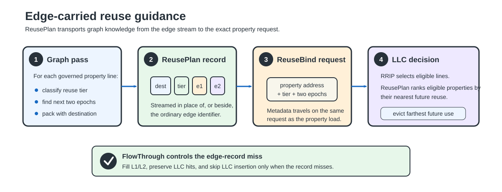
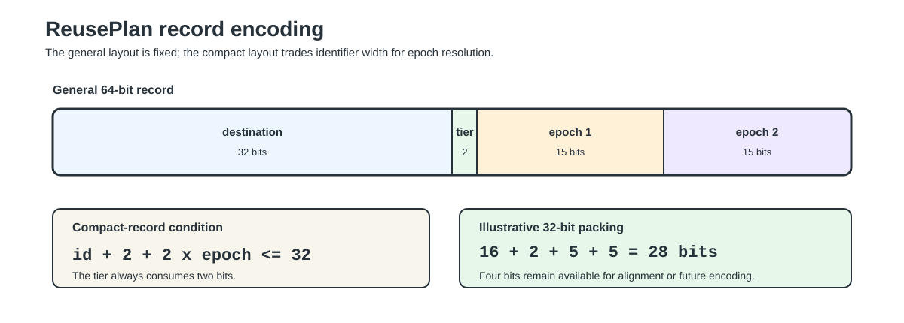
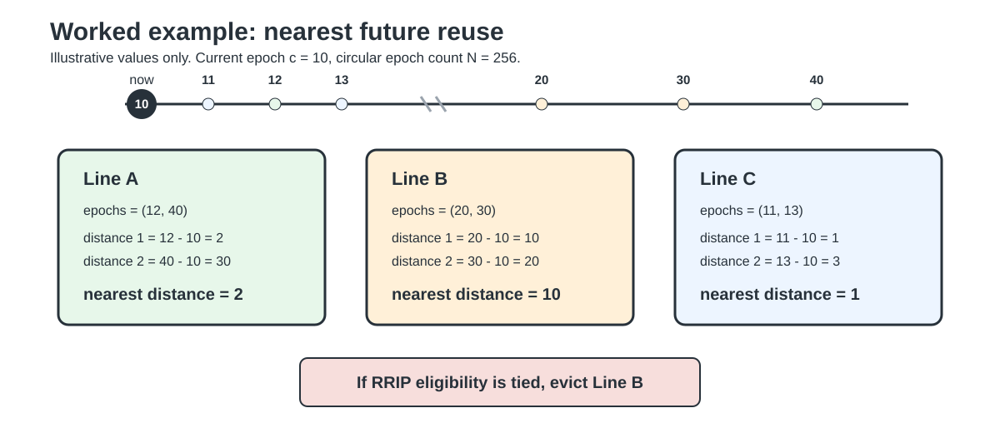
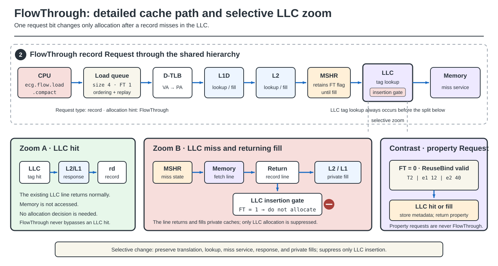

# ReusePlan and FlowThrough: Illustrated Design Guide

Graph programs commonly read an edge and then use its destination vertex to
load a property such as rank, distance, or component ID. The edge stream is
regular, but the property access is irregular. ReusePlan uses the edge record
as a small transport channel for information about the property line that will
be accessed next.

This page explains the mechanism only. It contains no experimental results;
final measurements will be published after the evaluation is complete.

## 1. Design in one figure

**Figure 1.** End-to-end flow from graph preprocessing to request-bound
metadata and LLC replacement.

An offline graph pass computes three fields for each governed property line:

1. a coarse reuse tier;
2. the epoch of its next use; and
3. the epoch of the following use.

The fields travel with the edge. ReuseBind attaches them to the exact property
request, and the LLC stores them as replacement metadata. FlowThrough applies
separately to the edge-record request so a one-touch record can still fill the
private caches without occupying the LLC after a miss.

## 2. ReusePlan record

**Figure 2.** General and compact ReusePlan record encodings.

The general record contains a 32-bit destination, a 2-bit tier, and two
15-bit epochs:

`destination | tier | epoch1 | epoch2`

For a compact 32-bit record, the graph-specific fields must satisfy

`id_bits + 2 + 2 x epoch_bits <= 32`.

The two epochs describe the next two future accesses to the governed property
line. Two future positions are useful because graph phases and interleaved
streams can make a single next-use marker fragile.

The tier is assigned per cache line rather than per vertex. If several
vertices share a line, the line receives the hottest tier among them. This
keeps the hint meaningful even when the graph is not physically reordered by
degree.

## 3. Computing future distance by hand

Let the traversal have `N` circular epochs, let `c` be the current epoch, and
let `e` be a delivered future epoch:

`distance(e, c) = (e + N - (c mod N)) mod N`.

ReusePlan uses the nearer of the two future epochs:

`ReusePlan distance = min(distance(epoch1, c), distance(epoch2, c))`.

The values in the following example are illustrative rather than measured.

**Figure 3.** Hand calculation of the nearest future reuse for three lines.

In the illustrative example, line B is needed later than lines A and C. If all
three lines are equally eligible under RRIP, ReusePlan chooses B as the victim
because its nearest future use is farthest away.

## 4. Replacement decision

The default static policy is **RRIP-first ReusePlan**:

1. use RRIP to find lines that are already strong eviction candidates;
2. among those candidates, evict an old edge-record line before a property
   line;
3. if only property lines remain, evict the line whose nearest ReusePlan reuse
   is farthest away;
4. age RRIP state and repeat when no line is yet eligible.

A small hand-worked set illustrates the ordering:

| Way | Type | RRPV | ReusePlan distance | Decision |
|---|---|---:|---:|---|
| A | property | 7 | 2 | keep |
| B | property | 7 | 10 | evict |
| C | property | 5 | 20 | not yet RRIP-eligible |
| D | property | 7 | 1 | keep |

Although C has the most distant future use, RRIP does not yet consider it
eligible. ReusePlan refines RRIP; it does not discard RRIP's recency state.

The code also contains an online selector that compares RRIP-first, GRASP,
epoch-first, degree-first, and LRU leader sets. That selector is useful for
studying phase changes, but the static RRIP-first policy is the primary design.

## 5. ReuseBind property loads

ReuseBind is the instruction family that attaches a ReusePlan to the exact
property request. It supports both a normal software-computed address and a
fused indexed address.

| Instruction | Purpose |
|---|---|
| `ecg.plan.load[.compact]` | Load a ReusePlan record with ordinary cache placement |
| `ecg.flow.load[.compact]` | Load a ReusePlan record with FlowThrough placement |
| `ecg.bind.load.*` | Load from a software-computed property address and bind the plan |
| `ecg.bind.iload.*` | Form the indexed property address and bind the plan in one instruction |

**Figure 4A.** Record acquisition and property-binding instructions have
separate request roles.

**Figure 4B.** Separate lanes follow the property request and record request
through every processor stage without crossing connectors.

The [detailed RISC-V instruction path](RISC-V-Instruction-Path) explains the
operand dependencies, address generation, LSQ state, request extensions,
cache actions, and completion rules shown in these figures.

The canonical computed-address path has separate record and property loads:

1. `ecg.flow.load` reads the ReusePlan record and carries the FlowThrough
   no-allocate bit.
2. Software computes the property address from the destination.
3. `ecg.bind.load.*` waits for both the address and ReusePlan metadata, then
   enters the load/store unit.
4. The load/store unit creates a normal load request and attaches the ReuseBind
   extension before the request enters the data-cache hierarchy.
5. The property data returns through normal completion and writeback.

No shared mailbox or later address lookup is needed to associate the hint with
the property line.

## 6. FlowThrough placement

**Figure 5.** FlowThrough preserves private-cache fills and LLC hits while
suppressing LLC insertion after a record miss.

FlowThrough changes only what happens after an edge-record miss:

- private-cache hits behave normally;
- LLC hits behave normally;
- an LLC miss fetches the record and fills the private cache;
- the returning record is not inserted into the LLC.

The property request is never bypassed. ReusePlan metadata still reaches the
property line and participates in replacement.

## 7. Hardware state

ReusePlan does not reserve LLC data ways. Its hardware cost is metadata and
control:

- two epoch fields and a tier for a governed property line;
- a validity/count field;
- request metadata for ReuseBind;
- one FlowThrough placement bit;
- optional counters for online policy selection.

The evaluation treats data-capacity and metadata-area costs separately. A design
with no reserved data ways is not a zero-cost design.

## 8. Simulator mapping

| Simulator | Purpose |
|---|---|
| **gem5 O3** | Architectural timing and request-bound ReuseBind behavior |
| **cache_sim** | Functional replacement behavior and memory traffic |
| **Sniper** | Larger-scale cache and traffic trends |

All three use the same replacement-policy implementation. Their delivery and
timing models differ, so absolute miss rates are not compared across
simulators. Timing claims are based only on gem5 O3.

## 9. Evaluation methodology

The PageRank study uses deterministic samples of web-Google, soc-pokec, and
cit-Patents, with several iteration counts. The comparison includes LRU,
GRASP, P-OPT controls, ReusePlan with an LRU replacement control, static RRIP-first
ReusePlan, and the online ReusePlan variant.

The primary quantities are:

1. gem5 O3 execution time; and
2. total off-chip traffic, including demand, prefetch, metadata, and writeback
   traffic.

Each comparison uses a matching baseline from the same build and experiment
cell. Instruction count is reported with time so a complete-design improvement
is not confused with a replacement-only improvement.

The current analytic P-OPT model charges its reserved LLC capacity and matrix
traffic but does not model matrix-stream latency. It is therefore an optimistic
bound, not a realistic P-OPT timing implementation.

## 10. Continue reading

- [Evaluation methodology](Evaluation-Methodology)
- [Build and reproduction guide](Reproduction)
- [Exact PageRank experiment specification](https://github.com/UVA-LavaLab/ECG_GrAPL/blob/main/scripts/experiments/ecg/configs/pagerank_study.json)
