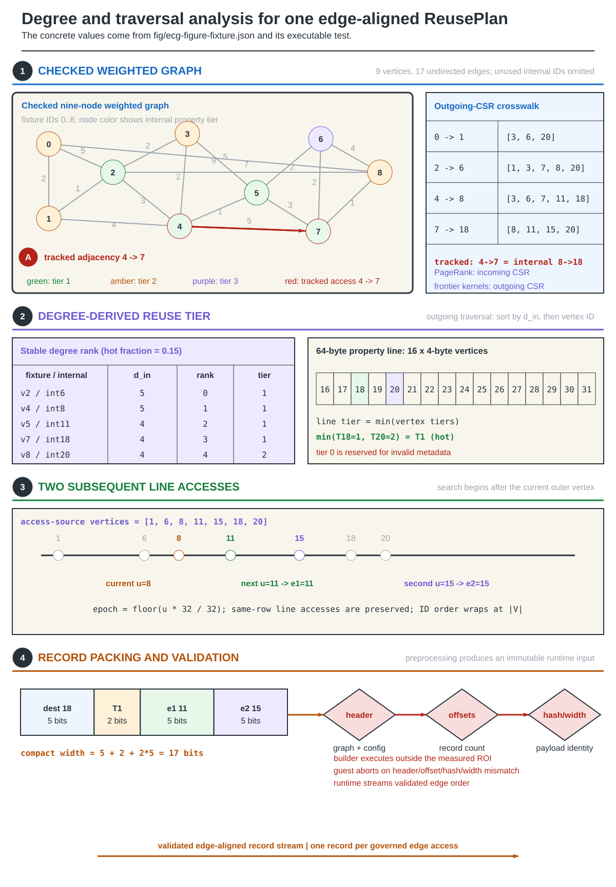
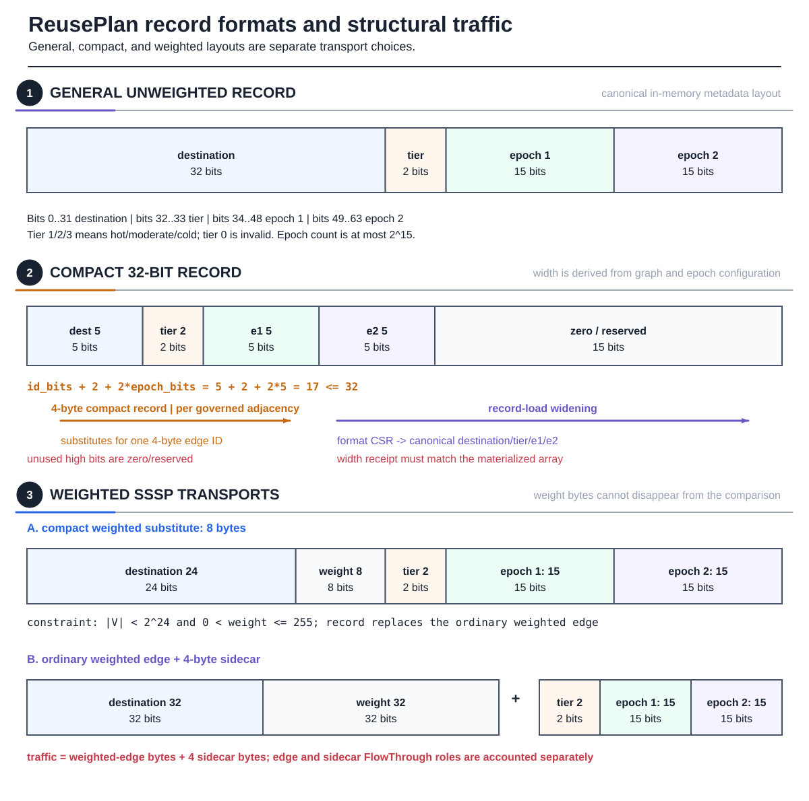
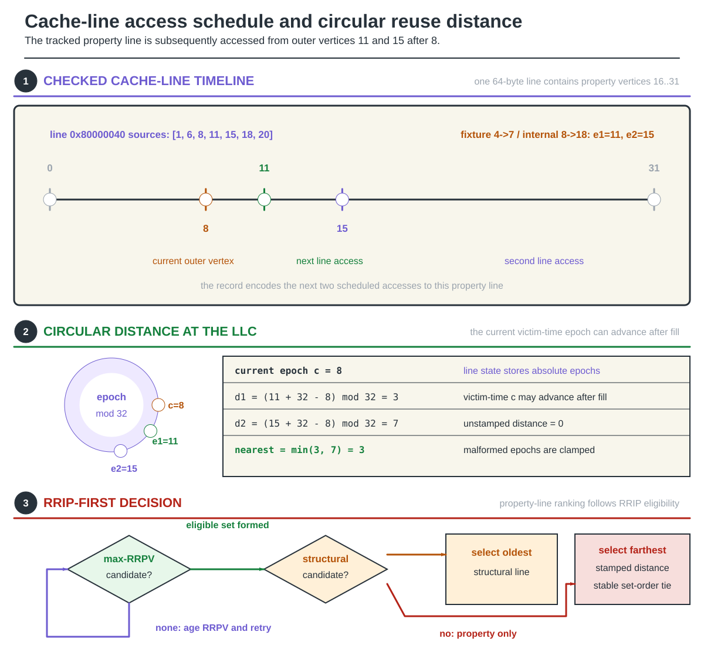
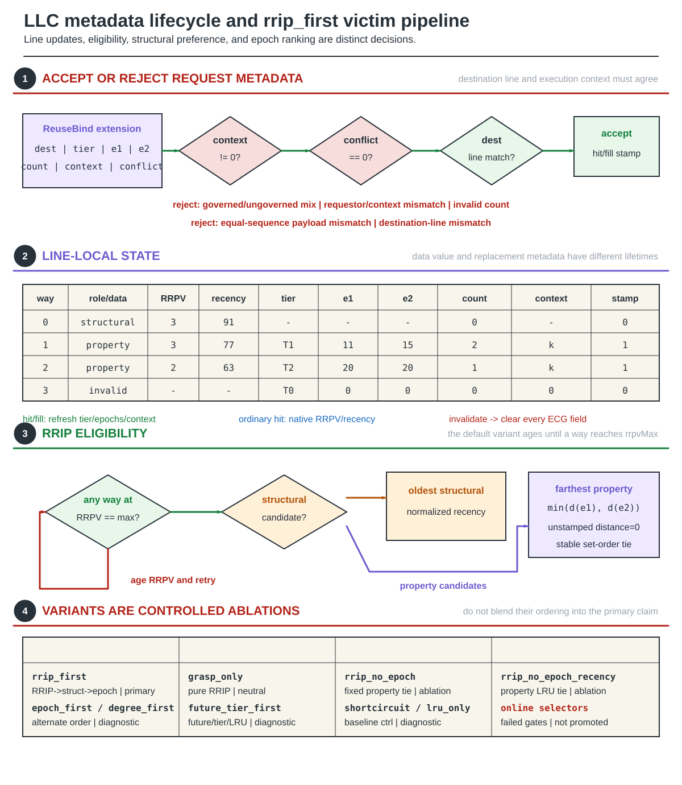
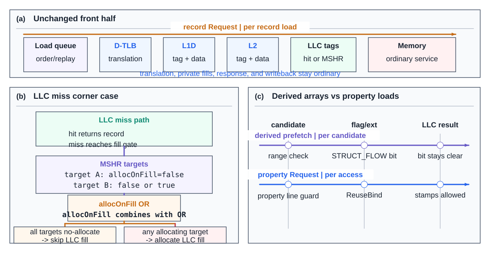
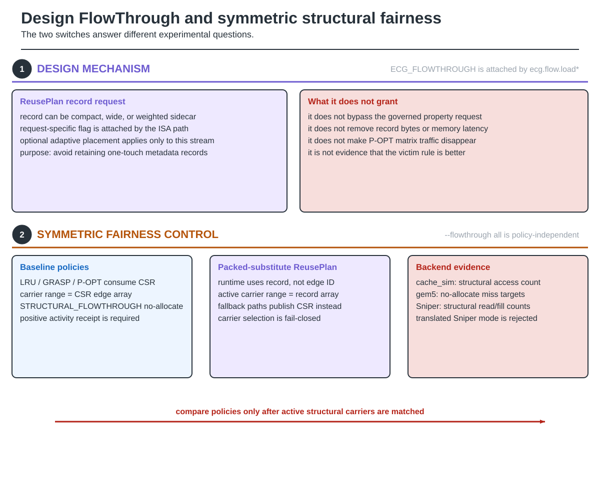

# ReusePlan and FlowThrough: Architecture Guide

Graph kernels stream structural records and then use each destination to access
a vertex property such as score, parent, distance, depth, or component label.
The structural stream is regular; the property address is irregular.
ReusePlan carries graph-derived guidance from the structural access to the
exact property Request. FlowThrough is a separate LLC placement decision.

This page owns the construction, wire-format, victim-policy, and placement
semantics. Instruction and MSHR details belong to the
[RISC-V instruction path](RISC-V-Instruction-Path).
It contains no experimental results.

## 1. Offline construction and the ROI boundary

### Figure 1 — From a checked reader graph to one edge-aligned ReusePlan



**Figure 1.** Every displayed value is derived from
`fig/ecg-figure-fixture.json`; the figure never mixes a second convenient
example into the construction.

The builder is kernel-direction aware:

- PageRank pull records follow the incoming-neighbor traversal.
- The implemented BFS, BC, CC, and SSSP paths follow their outgoing-neighbor
  traversal.
- The edge-aligned record offsets must match the corresponding canonical CSR.

Vertices are ranked by the number of property readers in that direction.
With the default hot fraction `f = 0.15`, the first `floor(f|V|)` vertices in
stable reader-count order receive tier 1, the next equally sized group tier 2,
and the rest tier 3. A property line receives the hottest tier among its
vertices.

For every governed edge, the builder searches the reader CSR strictly after
the current reader. It takes the next two references to any vertex in the
property line, wraps when necessary, preserves same-reader line reuse, and
quantizes each reader into the configured epoch space.

Record construction is not measured graph execution. Sidecar headers bind the
graph, configuration, width, ordering, record count, and payload. The guest
validates these facts before the ROI and aborts on disagreement.

## 2. Record formats and traffic

### Figure 2 — ReusePlan wire formats and honest traffic footprints



**Figure 2.** Format selection changes the real structural bytes and must be
bound to a runtime width receipt.

The general unweighted record is fixed:

```text
destination[32] | tier[2] | epoch1[15] | epoch2[15]
```

The compact record is graph-specific:

```text
id_bits + 2 + 2*epoch_bits <= 32
```

Unused upper compact bits are zero/reserved; they are not alignment bits.
The record-load execution helper widens a compact value into the canonical
64-bit metadata layout using the configured record-format CSR.

Weighted SSSP has two honest transports:

- a compact 64-bit substitute with 24-bit destination, 8-bit positive weight,
  tier, and two 15-bit epochs; or
- the ordinary weighted edge plus a 32-bit tier/epoch sidecar.

The latter costs edge bytes plus four metadata bytes. A comparison must not
erase the weight or sidecar traffic.

## 3. Future distance

### Figure 3 — Checked cache-line reuse timeline and circular distance



**Figure 3.** The same checked graph now exposes time: the line containing
internal properties 18 and 20 is read at internal readers
`1, 6, 8, 11, 15, 18, 20`.

For epoch `e`, current epoch `c`, and epoch count `N`:

```text
distance(e,c) = (e + N - (c mod N)) mod N
ReusePlan distance = min(distance(epoch1,c), distance(epoch2,c))
```

Malformed or out-of-range payloads are clamped before use. An unstamped
property line has effective distance zero, so only a live stamp participates
in future-distance ranking. A payload count of one preserves single-epoch
behavior; the minimum of two distances is used only when two epochs are live.

For the tracked record at current reader/epoch 8, `epoch1=11` and `epoch2=15`,
so the two distances are 3 and 7 and the stored pair contributes nearest
distance 3.

## 4. LLC state and victim selection

### Figure 4 — LLC metadata lifecycle and rrip_first victim pipeline



**Figure 4.** Request acceptance, metadata lifetime, insertion/refresh, and
victim ordering are distinct state transitions.

An LLC hit or fill accepts ReuseBind only when the extension is valid, the
execution context is nonzero, and the destination maps to the accessed
property line. Conflicted or mismatched metadata never becomes a live line
stamp. Invalidation clears the tier, epochs, context, count, and stamp-valid
state.

The default static rule is `rrip_first`:

1. age until at least one way reaches `rrpvMax`;
2. within that eligible set, select the oldest structural/non-property line;
3. if only property lines remain, select the farthest effective ReusePlan
   distance; and
4. use stable set order for an exact remaining tie.

This is the shared `ecg_policy::selectVictim` decision used by thin cache_sim,
gem5, and Sniper adapters. Delivery, cache populations, timing, and native line
state still differ across the simulators.

`grasp_only`, `epoch_first`, `degree_first`, `shortcircuit`, `lru_only`, and
the no-epoch controls are explicit ablations. The two online-selector
generations failed their representativeness/regret gates and are not promoted
to gem5 or Sniper performance policies. Admission diagnostics are separate
from victim selection.

## 5. FlowThrough cache behavior

### Figure 5 — FlowThrough changes LLC allocation, not lookup or service



**Figure 5.** The no-allocate decision is target-level and combines safely
when several requests share an MSHR.

FlowThrough preserves:

- normal address translation and load ordering;
- L1D, L2, and LLC tag lookup;
- all cache hits;
- memory miss service and response;
- private-cache fills; and
- architectural writeback and retirement.

On an LLC miss, a FlowThrough target contributes `allocOnFill=false`. gem5's
MSHR target list combines allocation requirements with logical OR. Therefore:

- an MSHR containing only no-allocate targets skips the LLC fill; but
- a mixed MSHR still allocates when any coalesced target requires the line.

A derived prefetch receives structural FlowThrough only when its own target
address remains inside the active structural-carrier range. The property
Request is never assigned FlowThrough.

## 6. Design mechanism versus symmetric fairness

### Figure 6 — Design FlowThrough and symmetric structural fairness



**Figure 6.** The two switches answer different experimental questions.

`ECG_FLOWTHROUGH` is the design mechanism attached by `ecg.flow.load*` to a
ReusePlan record Request. It may also use the separate adaptive placement
diagnostic.

`--flowthrough all` is the fairness control. It enables
`STRUCTURAL_FLOWTHROUGH` and publishes the actual active structural carrier
for every policy:

- CSR for LRU, GRASP, and P-OPT;
- the packed substitute when ReusePlan replaces CSR at runtime; or
- CSR when a candidate record path falls back.

cache_sim requires positive structural accesses, gem5 positive no-allocate
miss targets, and Sniper positive structural read/fill events. Sniper rejects
translated-address mode because the current published ranges are virtual.

Neither switch removes bytes, hides latency, or proves a better victim rule.

## 7. Instruction crosswalk

The cache mechanisms are reached through four experimental instruction roles:

- `ecg.plan.load` and the weighted Plan form acquire general/sidecar records
  with ordinary placement; there is no compact Plan-load encoding;
- `ecg.flow.load*` acquires general, compact, or weighted record data with
  FlowThrough placement;
- `ecg.bind.load.*` binds a plan to a computed-address property load; and
- `ecg.bind.iload.*` combines indexed address generation with binding.

Their operands, O3 stages, Request extension, and MSHR rules are owned by the
[RISC-V instruction path](RISC-V-Instruction-Path).

## 8. Hardware and evidence boundaries

ReusePlan does not reserve LLC data ways, but it is not free. Governed lines
store tier, epochs, count/validity, context, and ordinary replacement state.
Requests and MSHRs carry additional control state. Physical area/energy and
preprocessing costs must be reported separately from data capacity.

Only gem5 O3 timing is architectural speedup evidence. cache_sim supplies
functional policy/traffic evidence; Sniper supplies modeled cache/traffic
direction. Analytic P-OPT time remains optimistic because its target-time
matrix latency, bandwidth, and queueing are not charged.

Continue with [Evaluation methodology](Evaluation-Methodology) and
[Build and reproduction](Reproduction).
