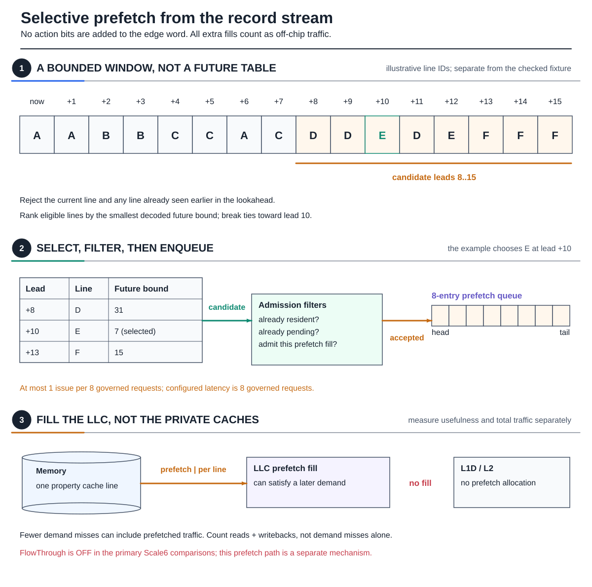

# Edge-carried records and cache control

ECG's current REF32 mechanism connects three decisions: **what information the
graph provides**, **how much of it fits beside an edge ID**, and **how the cache
uses the recovered prediction**. Full14 is the richer small-ID encoding;
Scale6 is the compact encoding used for Twitter-scale IDs. They are choices
within the design, not interchangeable names for the whole architecture.

## 1. Derive reuse from the actual traversal

PageRank pull visits the **in-neighbors** `N_in(u)` of an **outer vertex** `u`.
The record names the **property vertex** `v` whose contribution is loaded.
That value is read for destinations in `N_out(v)`, so its access count is
`d_out(v)`. Traversing **out-neighbors** `N_out(u)` instead gives property access
count `d_in(v)`, one access from each source in `N_in(v)`. The metadata must
follow the order the chosen kernel executes.

### Figure 1 — From one graph edge to its reuse mask


**Figure 1.** The shared 32-vertex fixture has nine non-isolated vertices.
At `u=8`, the in-neighbor row is `[3, 6, 7, 11, 18]`, occupying positions
`[14,19)`. Entry `j=18` names `v=18`. Position and vertex ID happen to agree
here; `j=22` also names vertex 18, demonstrating that they are different
quantities. The fixture is undirected, so incoming and outgoing rows agree;
the construction rule is still defined for the chosen traversal.

With four-byte properties and 64-byte lines, vertices `0..15` occupy line A
and `16..31` occupy line B. The next B access after `j=18` is `j=22`, hence
distance `4`. A reference is to the **next property-line use**, not necessarily
the next use of the same vertex. The later request to vertex 20 also uses B.

The semantic coordinate is `s = iteration_base + j + 1`. Record fetches,
score accesses, CPU cycles and the O3 instruction sequence number are not
substitutes for this governed-request coordinate.

## 2. Select a mask that fits the graph

### Figure 2 — Choose the mask to fit the graph


**Figure 2.** The available budget is `32 - b`, where
`b = max(1, ceil(log2 |V|))`. Twitter's 41,652,230 vertices need 26 ID bits,
leaving six metadata bits. A 262,144-vertex graph needs 18, leaving fourteen.
Our 32-vertex example needs five and has 27 spare bits.

The current implementation offers two explicit format families:

| Format | Implemented fields | Capacity and selection |
|---|---|---|
| **Full14** | `reference + 2 state + action = 14` bits; default `8 + 2 + 4` | Uses the actual ID width; fits graphs requiring at most 18 ID bits |
| **Scale6** | one 6-bit state/distance token | Fits selected ID widths through 26; the Twitter campaign and current native ABI use 26 |

Full14's reference field supports 6 through 12 bits while the remaining
metadata bits become the action field. Useful implemented examples are
`8/2/4`, `10/2/2`, and `12/2/0`. The reference always has five exponent bits;
additional bits provide mantissa precision. These choices are supported by
the codec and functional builder. The named experiment profiles pin their
own field settings rather than silently tuning them.

Full14 still uses **exactly fourteen metadata bits** on the small fixture:
the upper thirteen bits remain unused. Neither format automatically spends
all available padding. Intermediate graph sizes likewise do not imply an
unimplemented intermediate format.

For the running edge, Full14's reference code is `0x10`, FINITE is `1`,
and the action is `0`. With five ID bits:

```text
M = (0x10 << 5) | (1 << 13) = 0x00002200
R = 18 | M                  = 0x00002212
v = R & 0x1F               = 18
```

The same edge in the fixed 26+6 ABI is `0x10000012`. Scale6 combines state
and distance class rather than reserving independent state/action fields:

| Token | Meaning |
|---|---|
| `0` | UNKNOWN |
| `1` | DEAD: no remaining governed use in the requested horizon |
| `2..32` | FINITE; logarithmic bucket is `token - 2` |
| `33..63` | WRAP; next-traversal bucket is `token - 33` |

Full14 decoding is implemented in cache_sim. The native RISC-V instruction
pair currently decodes **only the fixed 26+6 ABI**, even for small bring-up
graphs. Available ID padding alone does not implement a richer native decoder.

## 3. Turn a relative reference into a bounded prediction

### Figure 3 — More metadata bits sharpen the future bound


**Figure 3.** Full14's default five-bit exponent plus three-bit mantissa
represents this distance `4` exactly. Scale6 uses
`bucket = floor(log2(distance))` and decodes the upper bound
`2^(bucket+1) - 1`: distance four becomes seven. The future deadline is
therefore `19+4=23` or `19+7=26`, respectively.

More bits matter most when they distinguish nearby distances. For the
separate distance-100 probe, reference widths 8, 10 and 12 decode to
103, 101 and 100; Scale6 decodes to 127. This illustrates precision, not an
extra access in the small graph. Encoding occurs in preprocessing; decoding
uses integer field extraction, shifts and addition, not a runtime logarithm.

The cache stores a deadline in semantic-request units. Full14's model defaults
to 21 deadline bits; the Scale6 campaign and native path use 32. This is a
separate choice from the reference field's precision. The configured traversal
must fit the deadline counter's safe half-range; ID width alone does not bound
edge count.

A held prediction becomes **UNKNOWN**, not DEAD, after its bound passes.
Later accesses can refresh it, so the expiry drawing deliberately freezes one
prediction. WRAP describes another traversal: it normalizes to FINITE when
another requested iteration remains, otherwise to DEAD.

## 4. Use the prediction to choose a victim

### Figure 4 — Why the encoded future changes an eviction


**Figure 4.** Consider a teaching snapshot containing A and B after `s19`.
A was last touched at `s18` and is needed at `s20`; B was touched at `s19`
and is needed at `s23`. A new scores-line C needs a way. Recency alone evicts A.
ECG's Scale6 deadlines are 21 and 26, so the remaining bounds at `s19` are 2
and 7. The actual shared score function maps them to 0 and 1 and selects B.
A remains for the immediately upcoming request. Full14's tighter deadlines
produce the same ordering in this case.

This is a one-set, two-way **policy illustration** with the shown requests;
other traffic and private-cache effects are omitted. It is not the production
LLC geometry or a measured performance result.

The implemented victim rule is more specific than “evict farthest future”:
invalid ways are available first; among valid candidates, explicit DEAD
properties precede non-property lines, followed by a shared property category.
FINITE candidates use `distanceRRPV(remaining)`, while UNKNOWN candidates use
`max(RRPV, local GRASP fallback)`. Higher scores are selected first; ties
compare unknown status, remaining bound, colder tier and recency. UNKNOWN does
not unconditionally outrank every FINITE line. A zero remaining bound scores
zero rather than requiring a logarithm of zero.

Freshness is as important as encoding. A private-cache hit advances the
program without a new LLC demand. The native path retains that load's own
prediction until retirement, then sends a bounded resident-only update.
The update changes prediction/RRPV fields, not data, dirty state, normal hit
statistics or recency.

An update does not itself evict a line. It changes the state consulted when a
later allocation needs a victim:

| Native event | Prediction effect | Data/allocation effect |
|---|---|---|
| governed request observed at the LLC | record PENDING and its semantic sequence, not a future deadline | ordinary demand service continues |
| live committed update reaches a matching resident line | install its normalized prediction; update RRPV for FINITE/DEAD | no data change, hit-stat increment or recency touch |
| delivered update is older than a pending observation | retain the newer pending state and count STALE | no data change |
| target line is absent | account for nonresidency and advance the received watermark | no allocation |
| a stored finite bound has passed | resolve its effective state as UNKNOWN | no inference that the data is globally dead |

cache_sim can stamp predictions on LLC demand service and model delayed
refreshes. Native demand observations instead mark PENDING and install
FINITE/DEAD only on timed retirement delivery. The functional known-dead
governed-miss bypass is **not** implemented speculatively in the native path.

## 5. Keep prefetch targeting distinct from reuse distance

### Figure 5 — Prefetch actions name a future record



**Figure 5.** The running window contains only A and B. B is current; A first
appears at lead `+1`, before the eligible `8..15` range. Later appearances
are duplicates. Full14 therefore carries action zero and Scale6 selects lead
zero: this record does **not** launch a prefetch.

For other records, the implementations select a target differently.
Full14's offline builder prioritizes the largest backward gap, then next-use
distance and proximity to lead ten, and encodes the selected forward-record
lead. Its two-bit action variant uses codes for `{none, 8, 12, 15}`.
Scale6 carries no action field: its selector examines the bounded record
window, chooses the first eligible distinct line with the smallest decoded
future bound, and breaks ties toward lead ten.

The selected lead identifies `R[j+lead]`; **that record's vertex** identifies
the property to fetch. The reuse-distance field is not a target vertex.
Resident, pending and admission checks precede the eight-entry LLC-only queue.
The primary functional model has eight governed requests of latency and at
most one issue per eight governed requests. Prefetch reads and dirty
writebacks remain part of total traffic.

Native prefetch is not implemented. It must consume real record bytes and
account for acquisition, translation and memory traffic rather than query a
host-side future table.

## 6. Separate graph storage, cache capacity and implementation cost

### Figure 6 — Graph-sized matrices and cache-sized state


**Figure 6.** Twitter's current/next P-OPT columns occupy about 4.97 MiB.
They require 10, 5 and 4 whole ways at 8, 16 and 24 MiB; the one-column SE
reconstruction requires 5, 3 and 2. Both retain the 256-column backing matrix
and full traversal stream charge. Two columns do not mean two cache ways.

ECG retains the data ways but adds prediction/control state. A deadline width
`D` contributes `D+3` logical bits per line, including state and prefetch
origin: 24 for the Full14 default and 35 for Scale6's 32-bit deadline. The
[state-ownership figure](Property-to-Cache-Walkthrough) gives the bounded
buffer totals. These are functional-model accounting figures, not a complete
native hardware-area estimate.

The edge mask has no separate per-edge metadata sidecar. Storage realization
still matters: the functional Full14 path uses a separate encoded carrier,
while in-place Scale6 construction avoids a second edge array. Full14's
construction uses edge-sized scratch; the bounded in-place Scale6 builder
uses first/next position arrays indexed by property line. Preprocessing
memory/time and runtime hardware state must be reported separately.

## Earlier mechanisms and controls

The stable page URL predates REF32. Earlier `ecg.plan.load`, `ecg.flow.load`,
`ecg.bind.load` and `ecg.bind.iload` family labels refer to the ReusePlan/
ReuseBind paths. They carry
two epoch hints and optional tiers; they are not the current request-distance
encoding. FlowThrough is a distinct structural no-allocation control and is
**off** in the primary REF32 comparisons. If used as a fairness control, it
must be applied symmetrically. Its MSHR `allocOnFill` rule combines with OR;
one non-allocating target cannot suppress another target's required fill.

## Implementation sources

| Surface | Source |
|---|---|
| field budgets, quantizers, record builders, victim score | `bench/include/ecg_ref32.h` |
| functional format selection and carrier storage | `bench/include/cache_sim/graph_cache_context.h` |
| functional queues and resource accounting | `bench/include/cache_sim/cache_sim.h` |
| PageRank traversal and action consumption | `bench/src_sim/pr.cc` |
| native in-place carrier and property loop | `bench/src_gem5/pr.cc` |
| native retirement and resident-line policy | `bench/include/gem5_sim/overlays/mem/cache/replacement_policies/` |
| named experiment profiles and evidence gates | `scripts/experiments/ecg/roi_matrix.py` |
