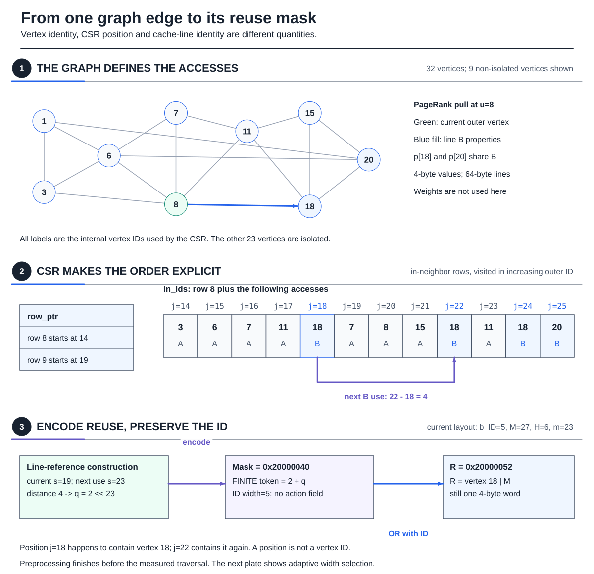
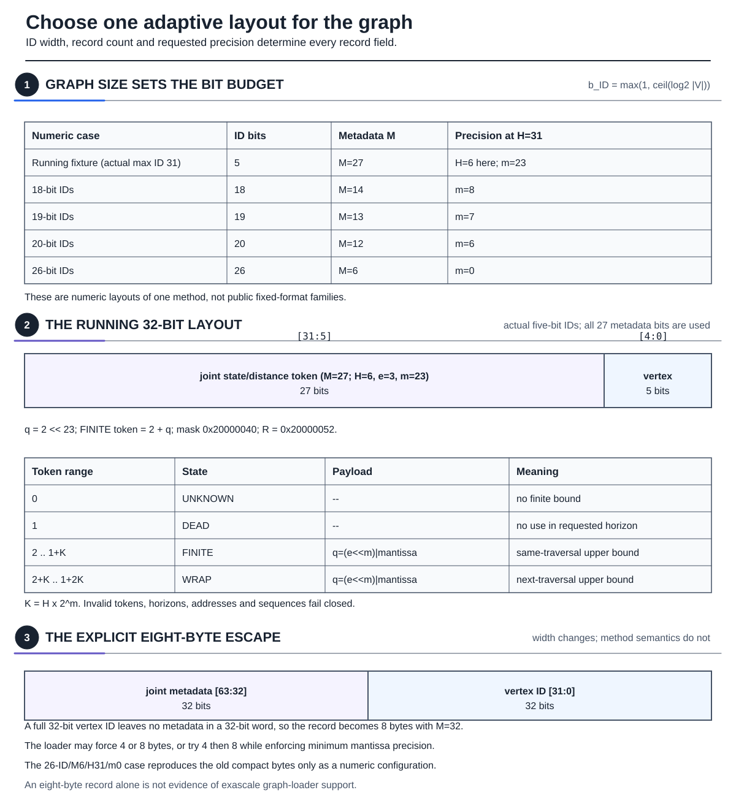
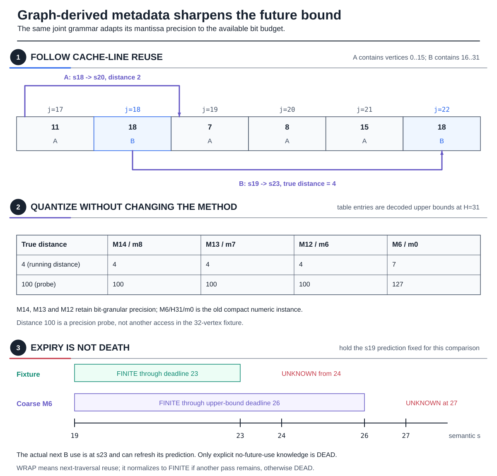
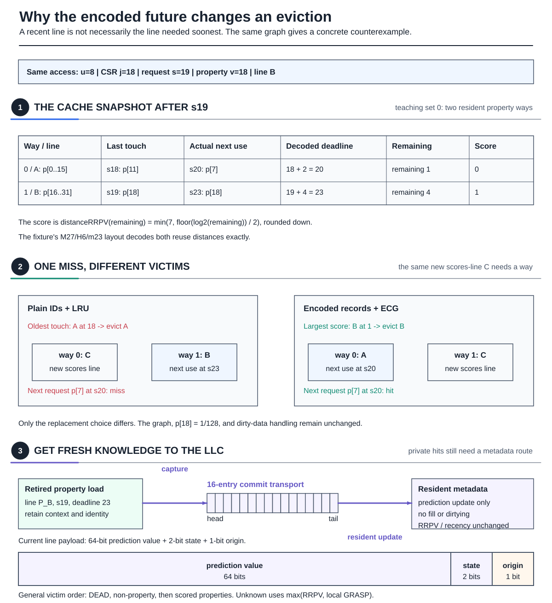

# Adaptive edge records and cache control

ECG connects three decisions: what the graph traversal knows, how that
information fits beside the actual vertex ID, and how a cache consumes the
result. The current implementation has one graph-adaptive record grammar and
four mechanisms: transport, replacement, prefetch, and
replacement-prefetch.

## 1. Derive reuse from the executed traversal

PageRank pull visits the **in-neighbors** `N_in(u)` of an **outer vertex** `u`.
The record names the **property vertex** `v`; property `p[v]` is read for
destinations in `N_out(v)`, so its request count is `d_out(v)`. A traversal
over out-neighbors `N_out(u)` instead reads `p[v]` once for each source in
`N_in(v)`, giving `d_in(v)`. Metadata must match the actual traversal order.

### Figure 1 — From one graph edge to its reuse mask



**Figure 1.** The fixture contains 32 vertices and 34 adjacency records.
At `u=8`, row `[14,19)` is `[3,6,7,11,18]`. Record `j=18` names `v=18`;
the next access to its 64-byte property line is `j=22`, so distance is four.
Semantic position is `s=iteration_base+j+1`, not a CPU cycle or O3 sequence.

## 2. Derive the bit-granular layout

### Figure 2 — Choose one adaptive layout for the graph



`Requirements` contains `vertex_count`, `max_vertex_id_known`,
`max_vertex_id`, `record_count`, `traversal_count`,
`requested_record_bytes`, and `minimum_mantissa_bits`. Let `W` be 32 or 64
record bits:

```text
id_bits       = max(1, bit_width(maximum encoded vertex ID))
metadata_bits = W - id_bits
H             = bit_width(record_count)
K             = H * 2^m
```

The layout chooses the largest `m` such that
`2 + 2*H*2^m <= 2^metadata_bits`. Selection tries four bytes and then eight
unless width is forced; `minimum_mantissa_bits` can require the wider carrier.
Using the maximum ID actually present preserves headroom when isolated
vertices make `vertex_count` larger.

The packed descriptor has a fixed signature and validates every field; it is
not a public research-version selector.

The joint token grammar is uniform:

| Token | Meaning |
|---|---|
| `0` | UNKNOWN |
| `1` | DEAD |
| `2 + q` | FINITE |
| `2 + K + q` | WRAP |

Here `q=(exponent<<m)|mantissa`. Decoding rounds upward, so distance is a
conservative bound. Invalid tokens, graph horizons, addresses, and checked
64-bit sequence/deadline arithmetic fail closed.

At `H=31`, 18-, 19-, and 20-bit IDs leave `M=14`, `13`, and `12`, selecting
`m=8`, `7`, and `6`. There is no cliff from 14 directly to 6 metadata bits
and no rounding of a 19-bit ID to 24 bits. The 26-ID/M6/H31/m0 case is one
numeric configuration of this method, not a standard format for every graph.
A full 32-bit ID requires an eight-byte record
with `M=32`; that does not by itself demonstrate an exascale graph loader.

For the fixture, `id_bits=5`, `M=27`, `H=6`, `exponent_bits=3`, and `m=23`.
Distance four gives `q=2<<23`, FINITE token `16777218`, mask `0x20000040`,
and record `0x20000052`. No bits are reserved for an action field.

## 3. Decode a conservative future bound

### Figure 3 — Graph-derived metadata sharpens the future bound



The fixture distances two and four decode exactly. At `s=19`, A's deadline is
20 and remaining bound is one; B's deadline is 23 and remaining bound is four.
At the same `H=31`, progressively smaller numeric budgets M14, M13, M12 and M6
select mantissas 8, 7, 6 and 0. These are precision points, not named methods.

A passed FINITE bound becomes UNKNOWN, never inferred DEAD. WRAP represents a
next-traversal reuse and normalizes to FINITE only when another requested
traversal remains; otherwise it becomes DEAD.

## 4. Update prediction state without touching recency

### Figure 4 — Why the encoded future changes an eviction



At watermark 19, A has remaining bound 1 and score 0; B has remaining bound 4
and score 1. LRU evicts older A, while ECG evicts B and retains the line needed
at `s=20`. This is a teaching snapshot, not a benchmark result.

Invalid ways and explicit DEAD properties are considered first. Otherwise the
baseline victim is LRU across all eligible lines: UNKNOWN and expired predictions
do not protect property arrays over frontier, heap or adjacency data. A live
FINITE LRU candidate may be replaced by a farther live FINITE property candidate.
This is an LRU-neutral fallback, not a universal never-worse-than-LRU guarantee.

A request observation may mark a resident line PENDING, but never FINITE or
DEAD and never advances the receiver watermark for free. A paid delivered
update advances the watermark even when stale or nonresident. Updates never
allocate, dirty, or change ordinary recency/RRPV.

Native retirement uses a 16-slot queue, at least eight CPU cycles of latency,
configurable capture width (default CPU commit width), one output per cycle,
and two versions per key with the oldest protected.

## 5. Use one real-record prefetch rule

### Figure 5 — One real-record window selects a prefetch


Every layout uses the same 16-record rule. For leads 8–15, retain only the
first occurrence of each distinct property line. Rank the smallest decoded
cyclic reuse bound first, then proximity to lead 10, then lower lead.
UNKNOWN and DEAD rank as infinity. The chosen future record supplies the
target vertex; reuse distance is not an address.

The fixture window contains only A and B. B is current and A first occurs at
lead one, so no eligible new line exists. If required record bytes are not
available, selection returns `NOT_READY` rather than fabricating no candidate.

Native acquisition reserves two 64-byte banks for a potentially unaligned
4-byte-record window, or three for an 8-byte-record window. Real L1D fills or acknowledged timing
reads supply bytes. MMU translation, retry-capable ports, bounded trigger and
property queues, one lookup-pipeline input per cycle, dedicated L1/L2/LLC
presence ports, the default 12-cycle lookup, the 8-cycle prefetch pipeline,
and final drain are charged.

The in-band mask is not an additional property-side demand: a 4-byte encoded
record replaces the 4-byte neighbor ID. Construction is separate setup work.
Lookahead acquisition and data prefetches can create additional traffic.
Weighted inputs currently retain stride-8 ID/weight source records alongside
the encoded ID stream; their cache-line overfetch is a layout cost, not free
mask storage, and must not be called bandwidth-neutral.

Property reads enter at the LLC boundary using `Request::PREFETCH` and an
acknowledged `ReadReq`; cache-owned `HardPFReq` is not used. Issue and
completion both suppress private/LLC duplicates. Admission examines the actual
selected victim, not an unrelated non-property way; a near FINITE victim blocks
the prefetch. A known-DEAD
demand miss has a request-scoped allocation bypass. MSHRs merge allocation
requirements with logical OR so a live demand still obtains its needed fill.

## 6. Separate graph storage, cache payload, and physical cost

### Figure 6 — Graph-sized matrices and cache-sized state


Current builders retain the original graph and construct a separate
`vector<uint32_t>` or `vector<uint64_t>` carrier. Their sparse line first/next
map is bounded by property lines; there are no edge-sized action or future
arrays. Report source stream, retained source, carrier payload, carrier
allocation, and auxiliary peak separately.

Current resident prediction payload is 64 value bits, two state bits, and one
origin bit: 67 bits per LLC line. This is separate from tags, data,
property/tier classification, ordinary recency/RRPV, validation, queues, and
port logic.

| LLC | Lines | Prediction payload |
|---|---:|---:|
| 8 MiB, 64-byte lines | 131,072 | 8,781,824 bits = 1,097,728 bytes |
| 24 MiB, 64-byte lines | 393,216 | 26,345,472 bits = 3,293,184 bytes |

These values are logical payload counts, not total silicon-area results.
The exact 24 MiB/16-way geometry has 24,576 sets and uses true modulo
indexing rather than rounded capacity or changed associativity.

P-OPT active-column reservations and the complete backing matrix remain
separate quantities. The one-column P-OPT-SE variants remain disclosed
reconstructions where the public artifact did not specify behavior.

## Ordered-filtered algorithm passes

The additional current kernels use the same record grammar, but BFS, SSSP,
CC and BC explicitly predict the next **potential designated read** in full
CSR order. Sorted frontiers consume strictly increasing structural positions.
Pass close accounts for every skipped position, including empty passes, and
advances only to the controller-computed end.

WRAP and DEAD become UNKNOWN in this mode. FINITE bounds are clamped to the
current pass end and expire when that boundary closes, even with coarse
quantization. Ordinary loads and stores to a governed line invalidate its
prediction through the bounded update channel, including private-cache hits.
UNKNOWN's existing value field prevents delayed updates from reviving an
invalidated prediction. Structural progress and delivered event order are
separate; the latter also orders paid ordinary-access invalidations.
An older delivered invalidation retains its original sequence and cannot erase
a newer observation or poison a subsequently delivered property update.

SSSP uses U64 distances with nonnegative int32 weights. BC uses checked U64
path counts, U32 depth and F32 dependencies. Its property transition requires
closed work, drain, a generation increment and one LLC metadata set per
modeled cycle/functional step; compatible immutable carriers can be reused.
CC pointer chasing and BC's CSR/depth DAG-membership reads remain ordinary
and counted. TC is dense exact only for a dedicated read-only U64 target-row
start array; its orientation, duplicate array and every adjacency intersection
are charged, not presented as predicted list accesses.

These kernels and contracts are implemented in cache_sim, RV64 gem5 and Sniper.
Bounded qualification and fresh performance measurements remain distinct in the
[per-algorithm table](Evaluation-Methodology#per-algorithm-performance).
The figures above retain the dense PageRank example and its original geometry.

## Implementation sources

| Surface | Source |
|---|---|
| current layout, codec and window selector | `bench/include/ecg_record.h` |
| stream construction/accounting | `bench/include/ecg_record_stream.h` |
| configuration and native contract | `bench/include/ecg_record_native.h` |
| receiver, victim and admission logic | `bench/include/ecg_record_runtime.h` |
| functional integration | `bench/include/cache_sim/cache_sim.h` |
| native guest and cache overlays | `bench/src_gem5/pr.cc`, `bench/include/gem5_sim/overlays/` |
| modeled Sniper integration | `bench/src_sniper/`, `bench/include/sniper_sim/overlays/` |
